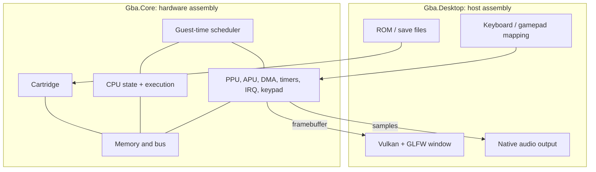

# Architecture: one machine, one host

Gba.Core owns all emulated state and behavior. Gba.Desktop owns the application lifecycle and physical devices. The emulated GBA must not know that Vulkan exists.



Arrows in this figure describe data flow; they do **not** all mean project references. The compile-time graph is simpler:

```text
Gba.Desktop ───references───> Gba.Core
Gba.Core.Tests ─references──> Gba.Core
```

Each `.csproj` builds an assembly; the `.sln` groups them. A `ProjectReference` lets Desktop compile calls to Core's public types. Core's internal types remain inside its assembly. Namespaces organize names, not dependency boundaries. [The project refresher](docs/csharp-and-dotnet/project-structure.md) explains the XML and CLI. [Microsoft assemblies](https://learn.microsoft.com/en-us/dotnet/standard/assembly/) explains the compiled unit; [access modifiers](https://learn.microsoft.com/en-us/dotnet/csharp/programming-guide/classes-and-structs/access-modifiers) explains public/internal/private.

## Keep ownership visible

| State / operation | Owner | Boundary idea, to design later |
| --- | --- | --- |
| CPU and hardware registers, RAM | Core | inspect state deliberately |
| Guest time and device events | Core | advance to a requested boundary |
| ROM bytes and save protocol | Core | receive bytes/configuration |
| File reads and persistence | Desktop | load/store bytes outside the machine |
| Logical GBA buttons | Core | receive a deterministic snapshot |
| Physical key/gamepad mapping | Desktop | translate host events |
| Final pixels / samples | Core | expose data with a lifetime contract |
| GPU, window, audio device | Desktop | upload/present/play outside Core |

Start single-threaded. The future boundary should document pixel format, dimensions, stride, audio format and whether data is copied or borrowed. A borrowed buffer may not be overwritten while the host still uses it. A ReadOnlySpan protects a caller's access path; it does not make underlying storage immutable. If threads become useful later, add explicit handoff/synchronization at this boundary.

The bus routes addresses and applies access rules; components own their registers and latches. The scheduler owns the guest timeline, while DMA can occupy bus time and stall the CPU. Keep simple concrete components and direct relationships. No dependency injection, service framework, factories or generic interface hierarchy is needed.

## Why this helps learning

You can test an instruction without a graphics driver, render synthetic video data without completing the CPU, and replace a host presentation detail without touching hardware logic. Deterministic input and guest time make regressions reproducible. Save states should capture machine state, never Vulkan handles or file objects.

Keep optional link cable/serial peripherals, unusual cartridge devices and hardware edge cases as explicit later scope. The first playable game milestone is a compatibility target, not proof of complete GBA accuracy. [Roadmap](ROADMAP.md) records this progression.
