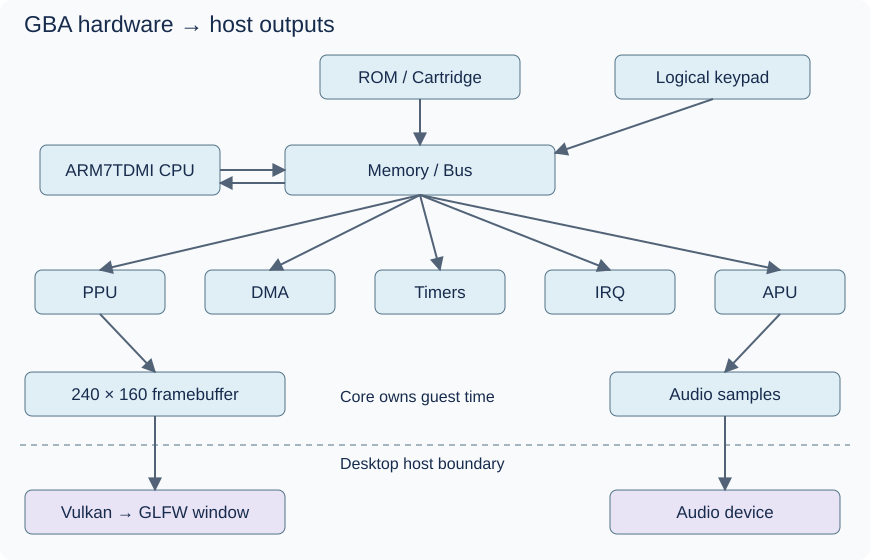

# RevoAdvance — build your own GBA emulator

**Begin with [Before you code](docs/00-getting-started/before-you-code.md)** for a plain-language introduction to the tools and a separate C# practice project. Then follow [Start here](docs/00-getting-started/README.md). Your first emulator-related exercise is one small xUnit test about extracting the low byte of an unsigned integer.

Some C# experience is enough to start. Each hardware lesson now opens with two small, runnable syntax examples, expected output, explanations and a practice step. The C# lessons add guided warm-ups too. Try one example at a time, predict a small change, then approach the unsolved emulator exercise. The examples use ordinary toy data; you write the actual emulator.

Each lesson tells you where to save your work, which PowerShell command to run, what should happen and what to rerun after an edit. Keep the [run and test guide](docs/00-getting-started/running-and-testing.md) nearby for setup, test filters and troubleshooting.

This is a learning repository for a Game Boy Advance emulator in C# and modern .NET, with eventual Vulkan output through Silk.NET and a GLFW host backend. No SDL and no C++ application code. You write the emulator; the repository supplies the path, explanations and empty project scaffolding.



```text
ROM + logical input → GBA CORE → framebuffer + audio + state
                                      ↓
                                 Desktop host
```

Core contains emulated hardware. Desktop eventually creates the window, presents pixels with Vulkan, maps physical input, plays audio and loads files. **Gba.Core has no dependency on Vulkan or desktop UI.** [Architecture](ARCHITECTURE.md) explains why and how project references enforce this direction.

## Your learning loop

Read a GBA concept → understand the real hardware → read the relevant C# refresher → decide how to represent it → implement it yourself → write tests → verify behavior → update [progress](progress/README.md) → choose one next task.

Use [ROADMAP](ROADMAP.md) to choose work, [docs](docs/README.md) to browse subjects and [REFERENCES](REFERENCES.md) for focused external reading. Chapters end with an exercise, observable completion criteria and likely mistakes. Hardware documentation explains rules; local examples explain tools without completing subsystems.

## Load, play and save your games

The finished emulator must let you open your own `.gba` files, play supported GBA games, save through the game's own menu, and continue that progress after closing and reopening the app. Later, emulator Save State/Load State will also let you resume a captured moment. These are required learning milestones; the current scaffold does not run games yet.

Follow [loading and playing](docs/12-cartridges-and-roms/loading-and-playing.md), then [saving and resuming](docs/12-cartridges-and-roms/saving-and-resuming.md). Your original ROM stays unchanged; cartridge saves and save states use separate files.

## C# refresher

[C# and .NET lessons](docs/csharp-and-dotnet/README.md) refresh language concepts exactly where they meet the hardware: integer widths for registers, arrays and endian order for memory, masks for decoding, and resource lifetime for Vulkan. Safe managed code is the starting point. Pointers and optimization are later topics with explicit reasons.

## Scaffold

- `src/Gba.Core`: empty hardware folders with reading links; no emulator source.
- `src/Gba.Desktop`: one placeholder message and empty host folders.
- `tests/Gba.Core.Tests`: xUnit v2 configuration, initially no test methods.
- `roms`: instructions only; supply legally obtained BIOS/ROM/test files yourself.
- `docs/assets`: original SVG diagrams; other figures use Mermaid, ASCII and tables.

```text
dotnet restore GbaEmulator.sln
dotnet build GbaEmulator.sln
dotnet run --project src/Gba.Desktop
dotnet test GbaEmulator.sln
```

The scaffold targets .NET 10 LTS. Install a stable .NET 10 SDK before building. The [project guide](docs/csharp-and-dotnet/project-structure.md) explains the project settings. See the [official support policy](https://dotnet.microsoft.com/en-us/platform/support/policy).

Building verifies scaffolding only. There is no functioning emulator yet, and an empty test run proves no hardware behavior. [Validation notes](docs/VALIDATION.md) record what was checked when this repository was created.
