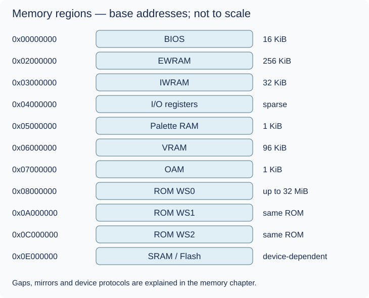

# Memory map: addresses are routes

## Before the technical details

An address is like a numbered street location. An offset is how far you are from the start of a particular building, and a size is how much fits inside it. Those are three different numbers. A memory map tells you which device answers an address; an array only stores elements. First become comfortable with positions and bounds.

## Syntax warm-up

### Open PowerShell and prepare this lesson

Open a PowerShell terminal (an IDE terminal is fine). Run this block once in each new terminal. The path below is your current checkout; if you move the repository, change that first path. All later commands on this page run from this folder, not from the lesson folder.

```powershell
Set-Location "C:\Users\victo\Desktop\RevoAdvance"
if (Test-Path ".work/dotnet10/dotnet.exe") {
    $env:PATH = "$PWD\.work\dotnet10;$env:PATH"
}
dotnet --version
```

Expect a version beginning with `10.`. The conditional uses the local SDK when present and changes PATH only for this terminal. If the command is missing or shows `8.`, complete the [.NET 10 setup](../00-getting-started/before-you-code.md#set-up-and-know-what-success-looks-like) before continuing.

Create the console scratchpad only if it does not already exist:

```powershell
if (-not (Test-Path ".work/SyntaxLab/SyntaxLab.csproj")) {
    dotnet new console --framework net10.0 --output .work/SyntaxLab
}
```

If it already exists, no output from that block is expected. Keep using that project; do not create another project for each example. [Command troubleshooting](../00-getting-started/running-and-testing.md) explains errors and the difference between running and testing.

Each example below is a complete, independent console program. Run one at a time in [SyntaxLab](../00-getting-started/before-you-code.md#a-separate-place-to-try-the-examples). These toy examples teach C#; the emulator implementation remains your exercise.

### Translate an outside number to a local position

**Run this example:** open `.work/SyntaxLab/Program.cs` in your editor, replace its entire contents with the C# block below, and save. Then run this in the PowerShell terminal prepared above:

```powershell
dotnet run --project .work/SyntaxLab/SyntaxLab.csproj
```

Compare the program output with “Expected output” below. After changing an example, save and run the same command again. Do not paste the command into the C# file. This command compiles your saved changes automatically.

```csharp
int firstLocker = 100;
int selectedLocker = 103;
int offset = selectedLocker - firstLocker;
Console.WriteLine(offset);
```

Expected output:

```text
3
```

The arithmetic asks “how far from the start?” The result is a local position, not a new storage allocation. These lockers are invented; GBA regions later add routing, mirroring and access rules.

### Use zero-based array indexes

**Run this example:** open `.work/SyntaxLab/Program.cs` in your editor, replace its entire contents with the C# block below, and save. Then run this in the PowerShell terminal prepared above:

```powershell
dotnet run --project .work/SyntaxLab/SyntaxLab.csproj
```

Compare the program output with “Expected output” below. After changing an example, save and run the same command again. Do not paste the command into the C# file. This command compiles your saved changes automatically.

```csharp
byte[] labels = { 10, 20, 30, 40 };
int last = labels.Length - 1;
Console.WriteLine(labels[0]);
Console.WriteLine(labels[last]);
```

Expected output:

```text
10
40
```

`byte[]` means an array of bytes. Square brackets select an element. `Length` is four, but the last valid index is three. Reading `labels[4]` would throw; an integer being representable does not make it a valid index.

### Try it before implementing

On paper, label a five-element array with indexes and values separately. Find the offset of locker 104, then explain why locker 105 would not fit a five-locker building beginning at 100. Only then use real GBA addresses below.

Continue with the detailed lesson below after you can explain your prediction.


## In the real GBA

An address identifies where a bus access goes. `0x06000000` is hexadecimal (base 16), with each digit standing for four bits. It is the start address of VRAM, not its size or an index into a giant array. Hardware manuals use hex because boundaries and bit fields align naturally with powers of two. The decimal spelling 100,663,296 describes the same address, but hides those boundaries.



The table gives base physical storage extents. Address windows and mirrors are larger than storage; do not allocate every address in a window.

| Region | Base physical extent (inclusive) | Storage | Users / purpose | Access quirks to investigate |
| --- | --- | ---: | --- | --- |
| BIOS | 0x00000000–0x00003FFF | 16 KiB | CPU firmware | read-only; protected reads outside BIOS execution |
| EWRAM | 0x02000000–0x0203FFFF | 256 KiB | CPU/DMA working data | mirrored; 16-bit external bus affects timing |
| IWRAM | 0x03000000–0x03007FFF | 32 KiB | CPU/DMA fast data | mirrored; 32-bit internal bus |
| I/O | 0x04000000–0x040003FE | sparse register area | CPU/DMA configure hardware | holes, widths, read masks and write side effects; not plain RAM |
| Palette | 0x05000000–0x050003FF | 1 KiB | PPU BG/OBJ colours | mirrored; byte writes duplicate into a halfword |
| VRAM | 0x06000000–0x06017FFF | 96 KiB | PPU pixel/tile storage | non-power-of-two mirror; byte writes depend on BG/OBJ area and mode |
| OAM | 0x07000000–0x070003FF | 1 KiB | PPU object attributes | mirrored; byte writes ignored |
| ROM WS0 | 0x08000000–0x09FFFFFF | up to 32 MiB | CPU/DMA cartridge reads | writes generally not ROM writes; cartridge devices can respond |
| ROM WS1 | 0x0A000000–0x0BFFFFFF | same ROM | alternate wait-state window | same data with different timing configuration |
| ROM WS2 | 0x0C000000–0x0DFFFFFF | same ROM | alternate wait-state window | EEPROM may respond in part of this space |
| SRAM / Flash | begins 0x0E000000 | device-dependent | persistent saves | 8-bit bus; Flash commands/banking differ from RAM |

KiB means 1,024 bytes. The save address window does not state the physical device capacity: common SRAM is 32 KiB and Flash can be 64 or 128 KiB with banking. Serial EEPROM is a different protocol, not an array in the SRAM range.

## In our emulator

Give physical regions storage and route reads/writes by address. A physical offset is the position inside the selected region. For an ordinary unmirrored access near VRAM's base, ask how far the address is from `0x06000000`; only then consider indexing. Do not apply modulo to every region: I/O, VRAM mirroring and cartridge devices need specific rules.

Start with EWRAM and a clear development diagnostic for unsupported addresses. Unknown access should produce a deliberate report or documented temporary fallback, not an accidental index exception. This fallback is not the final hardware open-bus model.

## In C#

Separate `uint` guest addresses from validated host indexes. Byte arrays are enough initially. Two adjacent unequal bytes reveal byte order: lower address `0x78`, next address `0x56` represent little-endian halfword `0x5678`. Wider accesses can cross boundaries, require alignment handling or have I/O semantics different from several byte accesses. The next bus chapter explains why storage and access behavior are separate concerns.


## C#/.NET concepts used here

- [Integer types, binary and hexadecimal](../csharp-and-dotnet/integer-types.md) — [Microsoft](https://learn.microsoft.com/en-us/dotnet/csharp/language-reference/builtin-types/integral-numeric-types): Ranges, literals and signedness.
- [Arrays, spans and byte order](../csharp-and-dotnet/arrays-and-spans.md) — [Microsoft](https://learn.microsoft.com/en-us/dotnet/csharp/language-reference/builtin-types/arrays): Zero-based indexing and array reference semantics.
- [Bitwise operations: a mini-course](../csharp-and-dotnet/bitwise-operations.md) — [Microsoft](https://learn.microsoft.com/en-us/dotnet/csharp/language-reference/operators/bitwise-and-shift-operators): AND, OR, XOR, complement and shift behavior.

## What you should understand now

- [ ] Address versus size versus offset.
- [ ] Why a memory map includes behavior as well as bytes.

## C#/.NET refresher

Work through the local explanations linked above, then use their paired official references for the named details. Prefer ordinary managed code; optional optimization pages are explicitly marked.

## Your implementation task

Represent EWRAM yourself, then implement the first byte read/write for that region. After that, add little-endian halfword and word tests with distinct bytes. Delay complete mirroring and side-effecting I/O until the bus chapter.

## Run and check your own implementation

Use the PowerShell terminal prepared at the top of this page, in the repository root. Write your tests in `tests/Gba.Core.Tests/MemoryMapTests.cs` with a **public class named `MemoryMapTests`** and public methods marked `[Fact]` or `[Theory]`. Add `using Xunit;` at the top. The [complete xUnit examples](../csharp-and-dotnet/testing.md#a-complete-fact-example-test-project-only) show the file structure; write the actual test bodies yourself. Test first/last storage positions, unsupported addresses and byte order. Emulator logic belongs in `src/Gba.Core`; the first low-byte practice needs no emulator component.

Save all edited files. Run each command separately, stopping if a command fails:

```powershell
dotnet build GbaEmulator.sln
dotnet test tests/Gba.Core.Tests/Gba.Core.Tests.csproj --list-tests
dotnet test tests/Gba.Core.Tests/Gba.Core.Tests.csproj --filter "FullyQualifiedName~MemoryMapTests" --logger "console;verbosity=normal"
dotnet test tests/Gba.Core.Tests/Gba.Core.Tests.csproj
```

The build should succeed. The list must include your new test methods. The filtered run must execute your `MemoryMapTests` cases and report zero failures; the last command runs **all** Core tests to catch regressions. The count depends on the cases you wrote. “No tests available” or “No test matches” is not a pass: check the saved file, public class/method, attribute and filter spelling. If you choose a different class name, change the filter to match it.

After each code or test edit, save and rerun the filtered command. When it passes, run the full test command again. For your first test, deliberately change one expected value, rerun to see a failed assertion, restore the correct value and rerun to see a pass. Do not leave the deliberately wrong expectation in your work. A compiler error must be fixed before you can evaluate assertions. These commands build automatically; do not use `--no-build` while learning because it can execute stale code.

## Definition of done

- First and last EWRAM bytes round-trip.
- Your unsupported-address policy is documented and deterministic.
- 16/32-bit tests demonstrate little endian and define boundary behavior.

## Common mistakes

- Allocating a 4 GiB byte array as the bus.
- Treating mirrored windows as separate storage.
- Assuming casts make an out-of-range host index valid.

## Further reading

- [GBATEK memory map](https://mgba-emu.github.io/gbatek/#gbamemorymap) — check physical sizes, windows and mirrors.
- [Tonc hardware](https://gbadev.net/tonc/hardware.html) — understand why RAM types and access costs differ.

## Next chapter

[ARM7TDMI before opcodes](../03-arm7tdmi/README.md)
