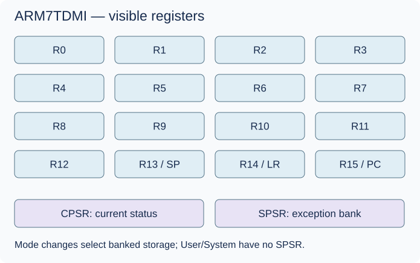

# ARM7TDMI before opcodes


## In the real GBA

The CPU reads instructions and transforms register/memory state. It implements ARMv4T, with 32-bit ARM encodings and 16-bit Thumb encodings. Thumb is a second instruction encoding state, not a second processor or a CPU privilege mode. Do not import Thumb-2 or newer ARM instructions.

At any instant software sees R0–R15 and CPSR. R0–R12 are ordinary working registers; R13 is conventionally SP (stack pointer), R14 LR (link/return address), R15 PC (program counter) with special behavior. “16 general registers” includes these special uses; PC is not just another array slot.



| Processor mode | Value | Banked state |
| --- | --- | --- |
| User | 0x10 | ordinary R0–R14; no SPSR |
| FIQ | 0x11 | R8–R14 and SPSR |
| IRQ | 0x12 | R13–R14 and SPSR |
| Supervisor | 0x13 | R13–R14 and SPSR |
| Abort | 0x17 | R13–R14 and SPSR |
| Undefined | 0x1B | R13–R14 and SPSR |
| System | 0x1F | shares User register bank; privileged, no SPSR |

Banking means switching which physical register storage a name refers to; it is not clearing registers. The architecture defines modes even when the GBA does not normally drive every corresponding external exception source.

```text
CPSR bit   31 30 29 28   27........8   7   6   5   4.....0
           N  Z  C  V     reserved    I   F   T     mode
           sign/zero/carry/overflow   IRQ FIQ Thumb
                                      masks
```

CPSR is current status. An exception mode's SPSR stores saved status for return. N is the result's sign bit; Z indicates zero; C records carry (subtraction uses no-borrow interpretation); V records signed overflow. These are not interchangeable. T selects Thumb; I/F mask exception acceptance. Preserve reserved bits as required by the architectural rules rather than inventing meanings.

The conceptual pipeline is fetch → decode → execute, with overlapping work. Reading PC usually observes current instruction address +8 in ARM or +4 in Thumb; operand role and instruction family introduce details, including alignment and stored-PC cases. A branch or state change refills the pipeline. Model the architectural visible PC separately from your internal fetch position instead of sprinkling increments everywhere.

```text
time →     slot 1     slot 2     slot 3     slot 4
instr A    fetch      decode    execute
instr B              fetch     decode     execute
instr C                        fetch      decode
```

## In our emulator

State includes visible/banked registers, CPSR/SPSRs, current instruction state, and a documented pipeline/fetch convention. CPU inputs are instruction bits, bus results and pending exception signals; outputs are state changes, accesses and consumed time. Memory byte order on the GBA is little endian. Word/halfword alignment rules belong to specific access instructions and the bus, not a blanket host alignment assumption.

Exception entry preserves return information and status, chooses a mode/vector, masks as specified and refills execution. SWI and undefined instructions are CPU exceptions too; peripheral IRQ delivery is only one case. See [exceptions and banking](exceptions.md) before implementing return paths.

## In C#

A concrete state class avoids accidental copies of mutable CPU state. Arrays may represent banks, but names and ownership must stay clear. `uint` preserves bit patterns; enums name modes; explicit operations clarify mode changes. Design on paper before writing handlers.


## C#/.NET concepts used here

- [Integer types, binary and hexadecimal](../csharp-and-dotnet/integer-types.md) — [Microsoft](https://learn.microsoft.com/en-us/dotnet/csharp/language-reference/builtin-types/integral-numeric-types): Ranges, literals and signedness.
- [Structs versus classes](../csharp-and-dotnet/structs-vs-classes.md) — [Microsoft](https://learn.microsoft.com/en-us/dotnet/csharp/language-reference/builtin-types/struct): Value copying versus shared identity.
- [Arrays, spans and byte order](../csharp-and-dotnet/arrays-and-spans.md) — [Microsoft](https://learn.microsoft.com/en-us/dotnet/csharp/language-reference/builtin-types/arrays): Zero-based indexing and array reference semantics.
- [Enums and named states](../csharp-and-dotnet/enums.md) — [Microsoft](https://learn.microsoft.com/en-us/dotnet/csharp/language-reference/builtin-types/enum): Named constants and underlying integral types.
- [Properties and fields](../csharp-and-dotnet/properties-and-fields.md) — [Microsoft](https://learn.microsoft.com/en-us/dotnet/csharp/programming-guide/classes-and-structs/properties): Accessors and encapsulation.

## What you should understand now

- [ ] Registers, modes and ARM/Thumb state are different concepts.
- [ ] CPSR and SPSR have different ownership.

## C#/.NET refresher

Work through the local explanations linked above, then use their paired official references for the named details. Prefer ordinary managed code; optional optimization pages are explicitly marked.

## Your implementation task

Represent CPU state and test mode switching independently of instruction execution. Document what your stored PC means. Then follow the first ARM instruction milestone.

## Definition of done

- Switching away from and back to a bank preserves its values.
- User/System share the intended bank.
- Tests distinguish C and V and verify CPSR field extraction.

## Common mistakes

- Copying a struct and changing only the copy.
- Giving User mode an SPSR.
- Incrementing PC both in fetch and in handlers.

## Further reading

- [ARM7TDMI manual](https://documentation-service.arm.com/static/5f4786a179ff4c392c0ff819) — programmer model, pipeline and cycle timing; distinguish core revision details.
- [GBATEK CPU reference](https://mgba-emu.github.io/gbatek/#armcpureference) — ARMv4T instruction and GBA-specific behavior.

## Next chapter

[ARM decoding one family at a time](../04-arm-instruction-set/README.md)
