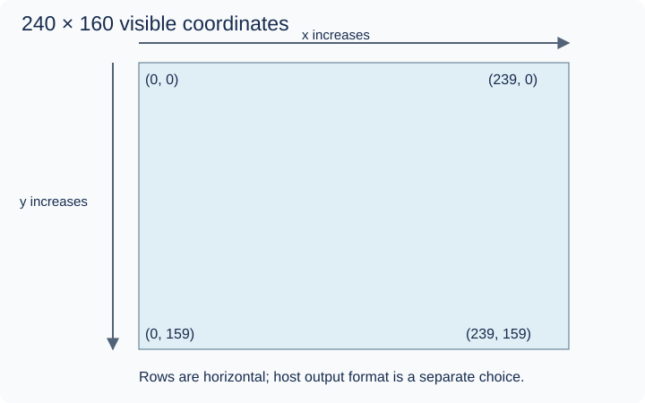
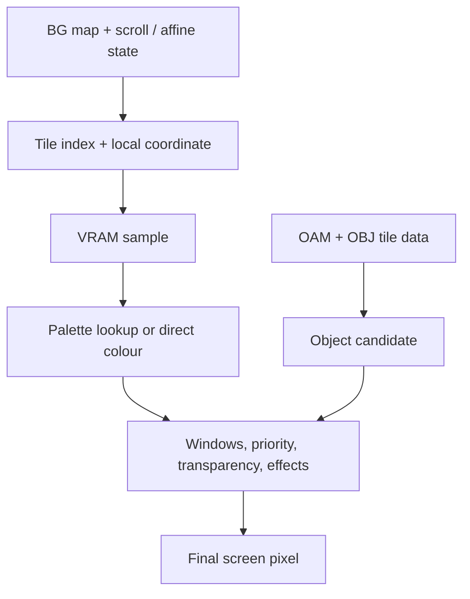

# PPU: turning video data into a picture

## In the real GBA

The screen is the final 240 × 160 visible grid. VRAM is storage used to construct it. In some modes VRAM holds directly addressable pixels; in others it holds reusable tiles and maps. A tile is a small pixel pattern. A tile map places patterns on a background. A palette converts a small colour index into a colour. OAM describes objects (“sprites”) using position, shape, tile and other attributes.

The PPU fetches candidate background and object pixels, applies window rules and priority, and optionally combines eligible colours through effects. Transparent pixels let lower layers show. This process happens along scanlines while the CPU and DMA can update registers and video storage.

## Inputs, outputs and register map

Inputs: VRAM at 0x06000000, palette RAM at 0x05000000, OAM at 0x07000000, display registers and guest time. Output: final colour pixels and display events that may request IRQs or trigger DMA. Main registers: DISPCNT 0x04000000, DISPSTAT 0x04000004, VCOUNT 0x04000006, BGCNT 0x04000008–0x0400000E, scroll/affine registers, window registers 0x04000040–0x0400004A, MOSAIC 0x0400004C, and blend registers 0x04000050–0x04000054. Register widths and writable bits differ.

## In our emulator

Begin with a headless framebuffer: a buffer representing the final image. You can verify pixels by values and a simple image export before a desktop renderer exists. A Mode 3 exercise can read synthetic VRAM without waiting for a complete CPU. This is a test fixture, not evidence that a ROM executed correctly.

Then render scanlines with display state. A simple scanline renderer can latch state at a documented point; mid-scanline writes will be inaccurate until you model finer timing. The CPU must never render an entire frame after each instruction.

## Read these subchapters as needed

1. [Bitmap modes](bitmap-modes.md) — shortest route to a first pixel.
2. [Display timing](display-timing.md) — scanlines and blanking events.
3. [VRAM layouts](vram.md) — storage depends on display mode.
4. [Tiles and backgrounds](tile-modes.md) — map → tile → palette.
5. [Sprites and OAM](sprites.md) — object state and affine parameters.
6. [Composition](composition.md) — affine sampling, priorities, windows and blending.

## In C#

Use arrays and explicit integer coordinate calculations. A small value describing a candidate pixel may help reasoning, but do not allocate a class per pixel. Your framebuffer's chosen host colour format is distinct from GBA 15-bit colour storage. Document channel order, stride and buffer ownership.

## C#/.NET concepts used here

- [Arrays, spans and byte order](../csharp-and-dotnet/arrays-and-spans.md) — [Microsoft](https://learn.microsoft.com/en-us/dotnet/csharp/language-reference/builtin-types/arrays): Zero-based indexing and array reference semantics.
- [Integer types, binary and hexadecimal](../csharp-and-dotnet/integer-types.md) — [Microsoft](https://learn.microsoft.com/en-us/dotnet/csharp/language-reference/builtin-types/integral-numeric-types): Ranges, literals and signedness.
- [Bitwise operations: a mini-course](../csharp-and-dotnet/bitwise-operations.md) — [Microsoft](https://learn.microsoft.com/en-us/dotnet/csharp/language-reference/operators/bitwise-and-shift-operators): AND, OR, XOR, complement and shift behavior.
- [Structs versus classes](../csharp-and-dotnet/structs-vs-classes.md) — [Microsoft](https://learn.microsoft.com/en-us/dotnet/csharp/language-reference/builtin-types/struct): Value copying versus shared identity.

## What you should understand now

- [ ] The screen is output; VRAM is an input representation.
- [ ] Visible pixels can come from several competing layers.

## C#/.NET refresher

Work through the local explanations linked above, then use their paired official references for the named details. Prefer ordinary managed code; optional optimization pages are explicitly marked.

## Your implementation task

Follow the bitmap chapter to build a synthetic Mode 3 scene yourself. Test corner pixels and channel values before integrating the CPU or Vulkan.

## Definition of done

- A 240 × 160 buffer has known corner and centre pixels.
- A saved/debug-view image has the expected orientation and colours.
- The fixture is clearly separated from ROM-driven execution.

## Common mistakes

- Confusing tile data with already arranged screen pixels.
- Using floating-point rounding accidentally in integer pixel addressing.
- Implementing all effects before the first bitmap works.

## Further reading

- [Tonc video](https://gbadev.net/tonc/video.html) — screen versus video storage mental model.
- [GBATEK video](https://mgba-emu.github.io/gbatek/#gbalcdvideocontroller) — register semantics and display behavior.

## Next chapter

[Begin with bitmap modes](bitmap-modes.md), then [interrupts](../08-interrupts/README.md).
