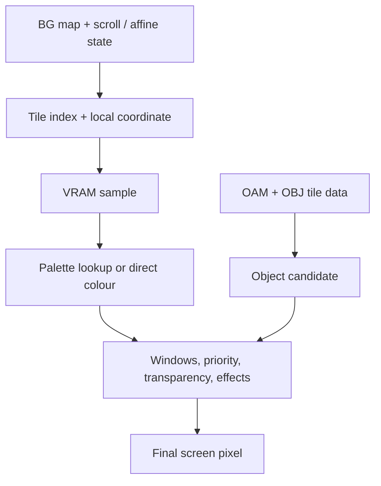

# PPU: turning video data into a picture

## Before the technical details

A pixel is one location in a picture. A framebuffer is a collection of finished pixel values. The PPU is the guest hardware that interprets video data to choose those values; Vulkan eventually shows the completed image on your PC. Begin with tiny rows and columns before any graphics API.

## Syntax warm-up

### Open PowerShell and prepare this lesson

Open a PowerShell terminal (an IDE terminal is fine). Run this block once in each new terminal. The path below is your current checkout; if you move the repository, change that first path. All later commands on this page run from this folder, not from the lesson folder.

```powershell
Set-Location "C:\Users\victo\Desktop\RevoAdvance"
if (Test-Path ".work/dotnet10/dotnet.exe") {
    $env:PATH = "$PWD\.work\dotnet10;$env:PATH"
}
dotnet --version
```

Expect a version beginning with `10.`. The conditional uses the local SDK when present and changes PATH only for this terminal. If the command is missing or shows `8.`, complete the [.NET 10 setup](../00-getting-started/before-you-code.md#set-up-and-know-what-success-looks-like) before continuing.

Create the console scratchpad only if it does not already exist:

```powershell
if (-not (Test-Path ".work/SyntaxLab/SyntaxLab.csproj")) {
    dotnet new console --framework net10.0 --output .work/SyntaxLab
}
```

If it already exists, no output from that block is expected. Keep using that project; do not create another project for each example. [Command troubleshooting](../00-getting-started/running-and-testing.md) explains errors and the difference between running and testing.

Each example below is a complete, independent console program. Run one at a time in [SyntaxLab](../00-getting-started/before-you-code.md#a-separate-place-to-try-the-examples). These toy examples teach C#; the emulator implementation remains your exercise.

### Flatten a tiny grid

**Run this example:** open `.work/SyntaxLab/Program.cs` in your editor, replace its entire contents with the C# block below, and save. Then run this in the PowerShell terminal prepared above:

```powershell
dotnet run --project .work/SyntaxLab/SyntaxLab.csproj
```

Compare the program output with “Expected output” below. After changing an example, save and run the same command again. Do not paste the command into the C# file. This command compiles your saved changes automatically.

```csharp
int width = 3;
int x = 1;
int y = 1;
int position = y * width + x;
Console.WriteLine(position);
```

Expected output:

```text
4
```

The first row occupies positions 0–2; the next row starts at 3. Multiplication skips whole rows and addition moves within the chosen row. This is a generic three-column grid, not a PPU renderer.

### Retrieve a named colour

**Run this example:** open `.work/SyntaxLab/Program.cs` in your editor, replace its entire contents with the C# block below, and save. Then run this in the PowerShell terminal prepared above:

```powershell
dotnet run --project .work/SyntaxLab/SyntaxLab.csproj
```

Compare the program output with “Expected output” below. After changing an example, save and run the same command again. Do not paste the command into the C# file. This command compiles your saved changes automatically.

```csharp
string[] colours = { "red", "green", "blue" };
int selected = 2;
Console.WriteLine(colours[selected]);
```

Expected output:

```text
blue
```

An index can refer to a colour rather than being a colour itself. That distinction prepares you for palettes. An array of colour names is just a teaching aid; actual pixel formats use numeric channel values.

### Try it before implementing

Draw a 3-by-2 grid numbered 0 through 5. Predict the position of the bottom-right cell and explain why x = 3 is outside the row. Follow the bitmap lesson before moving to tiles or effects.

Continue with the detailed lesson below after you can explain your prediction.


## In the real GBA

The screen is the final 240 × 160 visible grid. VRAM is storage used to construct it. In some modes VRAM holds directly addressable pixels; in others it holds reusable tiles and maps. A tile is a small pixel pattern. A tile map places patterns on a background. A palette converts a small colour index into a colour. OAM describes objects (“sprites”) using position, shape, tile and other attributes.


The PPU fetches candidate background and object pixels, applies window rules and priority, and optionally combines eligible colours through effects. Transparent pixels let lower layers show. This process happens along scanlines while the CPU and DMA can update registers and video storage.



## Inputs, outputs and register map

Inputs: VRAM at 0x06000000, palette RAM at 0x05000000, OAM at 0x07000000, display registers and guest time. Output: final colour pixels and display events that may request IRQs or trigger DMA. Main registers: DISPCNT 0x04000000, DISPSTAT 0x04000004, VCOUNT 0x04000006, BGCNT 0x04000008–0x0400000E, scroll/affine registers, window registers 0x04000040–0x0400004A, MOSAIC 0x0400004C, and blend registers 0x04000050–0x04000054. Register widths and writable bits differ.

## In our emulator

Begin with a headless framebuffer: a buffer representing the final image. You can verify pixels by values and a simple image export before a desktop renderer exists. A Mode 3 exercise can read synthetic VRAM without waiting for a complete CPU. This is a test fixture, not evidence that a ROM executed correctly.

Then render scanlines with display state. A simple scanline renderer can latch state at a documented point; mid-scanline writes will be inaccurate until you model finer timing. The CPU must never render an entire frame after each instruction.

## Read these subchapters as needed

1. [Bitmap modes](bitmap-modes.md) — shortest route to a first pixel.
2. [Display timing](display-timing.md) — scanlines and blanking events.
3. [VRAM layouts](vram.md) — storage depends on display mode.
4. [Tiles and backgrounds](tile-modes.md) — map → tile → palette.
5. [Sprites and OAM](sprites.md) — object state and affine parameters.
6. [Composition](composition.md) — affine sampling, priorities, windows and blending.

## In C#

Use arrays and explicit integer coordinate calculations. A small value describing a candidate pixel may help reasoning, but do not allocate a class per pixel. Your framebuffer's chosen host colour format is distinct from GBA 15-bit colour storage. Document channel order, stride and buffer ownership.


## C#/.NET concepts used here

- [Arrays, spans and byte order](../csharp-and-dotnet/arrays-and-spans.md) — [Microsoft](https://learn.microsoft.com/en-us/dotnet/csharp/language-reference/builtin-types/arrays): Zero-based indexing and array reference semantics.
- [Integer types, binary and hexadecimal](../csharp-and-dotnet/integer-types.md) — [Microsoft](https://learn.microsoft.com/en-us/dotnet/csharp/language-reference/builtin-types/integral-numeric-types): Ranges, literals and signedness.
- [Bitwise operations: a mini-course](../csharp-and-dotnet/bitwise-operations.md) — [Microsoft](https://learn.microsoft.com/en-us/dotnet/csharp/language-reference/operators/bitwise-and-shift-operators): AND, OR, XOR, complement and shift behavior.
- [Structs versus classes](../csharp-and-dotnet/structs-vs-classes.md) — [Microsoft](https://learn.microsoft.com/en-us/dotnet/csharp/language-reference/builtin-types/struct): Value copying versus shared identity.

## What you should understand now

- [ ] The screen is output; VRAM is an input representation.
- [ ] Visible pixels can come from several competing layers.

## C#/.NET refresher

Work through the local explanations linked above, then use their paired official references for the named details. Prefer ordinary managed code; optional optimization pages are explicitly marked.

## Your implementation task

Follow the bitmap chapter to build a synthetic Mode 3 scene yourself. Test corner pixels and channel values before integrating the CPU or Vulkan.

## Run and check your own implementation

Use the PowerShell terminal prepared at the top of this page, in the repository root. Write your tests in `tests/Gba.Core.Tests/PpuTests.cs` with a **public class named `PpuTests`** and public methods marked `[Fact]` or `[Theory]`. Add `using Xunit;` at the top. The [complete xUnit examples](../csharp-and-dotnet/testing.md#a-complete-fact-example-test-project-only) show the file structure; write the actual test bodies yourself. Test exact expected pixels from a small synthetic fixture without opening a window. Emulator logic belongs in `src/Gba.Core`; the first low-byte practice needs no emulator component.

Save all edited files. Run each command separately, stopping if a command fails:

```powershell
dotnet build GbaEmulator.sln
dotnet test tests/Gba.Core.Tests/Gba.Core.Tests.csproj --list-tests
dotnet test tests/Gba.Core.Tests/Gba.Core.Tests.csproj --filter "FullyQualifiedName~PpuTests" --logger "console;verbosity=normal"
dotnet test tests/Gba.Core.Tests/Gba.Core.Tests.csproj
```

The build should succeed. The list must include your new test methods. The filtered run must execute your `PpuTests` cases and report zero failures; the last command runs **all** Core tests to catch regressions. The count depends on the cases you wrote. “No tests available” or “No test matches” is not a pass: check the saved file, public class/method, attribute and filter spelling. If you choose a different class name, change the filter to match it.

After each code or test edit, save and rerun the filtered command. When it passes, run the full test command again. For your first test, deliberately change one expected value, rerun to see a failed assertion, restore the correct value and rerun to see a pass. Do not leave the deliberately wrong expectation in your work. A compiler error must be fixed before you can evaluate assertions. These commands build automatically; do not use `--no-build` while learning because it can execute stale code.

## Definition of done

- A 240 × 160 buffer has known corner and centre pixels.
- A saved/debug-view image has the expected orientation and colours.
- The fixture is clearly separated from ROM-driven execution.

## Common mistakes

- Confusing tile data with already arranged screen pixels.
- Using floating-point rounding accidentally in integer pixel addressing.
- Implementing all effects before the first bitmap works.

## Further reading

- [Tonc video](https://gbadev.net/tonc/video.html) — screen versus video storage mental model.
- [GBATEK video](https://mgba-emu.github.io/gbatek/#gbalcdvideocontroller) — register semantics and display behavior.

## Next chapter

[Begin with bitmap modes](bitmap-modes.md), then [interrupts](../08-interrupts/README.md).
