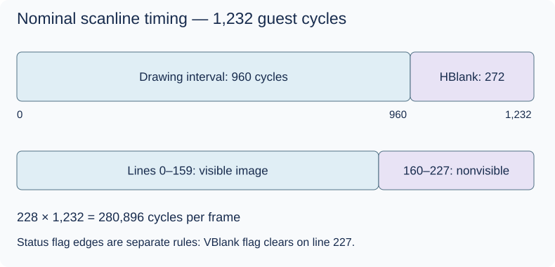

# Scanlines, HBlank and VBlank

## Before the technical details

The GBA builds a display over time in lines, with visible and blanking periods. A blanking period is part of the guest timeline, not an instruction to sleep your PC thread. Before tracking display events, practice half-open intervals: include the beginning and exclude the end.

## Syntax warm-up

### Open PowerShell and prepare this lesson

Open a PowerShell terminal (an IDE terminal is fine). Run this block once in each new terminal. The path below is your current checkout; if you move the repository, change that first path. All later commands on this page run from this folder, not from the lesson folder.

```powershell
Set-Location "C:\Users\victo\Desktop\RevoAdvance"
if (Test-Path ".work/dotnet10/dotnet.exe") {
    $env:PATH = "$PWD\.work\dotnet10;$env:PATH"
}
dotnet --version
```

Expect a version beginning with `10.`. The conditional uses the local SDK when present and changes PATH only for this terminal. If the command is missing or shows `8.`, complete the [.NET 10 setup](../00-getting-started/before-you-code.md#set-up-and-know-what-success-looks-like) before continuing.

Create the console scratchpad only if it does not already exist:

```powershell
if (-not (Test-Path ".work/SyntaxLab/SyntaxLab.csproj")) {
    dotnet new console --framework net10.0 --output .work/SyntaxLab
}
```

If it already exists, no output from that block is expected. Keep using that project; do not create another project for each example. [Command troubleshooting](../00-getting-started/running-and-testing.md) explains errors and the difference between running and testing.

Each example below is a complete, independent console program. Run one at a time in [SyntaxLab](../00-getting-started/before-you-code.md#a-separate-place-to-try-the-examples). These toy examples teach C#; the emulator implementation remains your exercise.

### Read a half-open interval

**Run this example:** open `.work/SyntaxLab/Program.cs` in your editor, replace its entire contents with the C# block below, and save. Then run this in the PowerShell terminal prepared above:

```powershell
dotnet run --project .work/SyntaxLab/SyntaxLab.csproj
```

Compare the program output with “Expected output” below. After changing an example, save and run the same command again. Do not paste the command into the C# file. This command compiles your saved changes automatically.

```csharp
int time = 5;
int begin = 2;
int end = 5;
bool inInterval = time >= begin && time < end;
Console.WriteLine(inInterval);
```

Expected output:

```text
False
```

This interval contains two, three and four. Five begins the next interval. Explicit boundaries help prevent an event from belonging to both neighboring periods.

### Find a position within a repeating toy schedule

**Run this example:** open `.work/SyntaxLab/Program.cs` in your editor, replace its entire contents with the C# block below, and save. Then run this in the PowerShell terminal prepared above:

```powershell
dotnet run --project .work/SyntaxLab/SyntaxLab.csproj
```

Compare the program output with “Expected output” below. After changing an example, save and run the same command again. Do not paste the command into the C# file. This command compiles your saved changes automatically.

```csharp
int elapsed = 17;
int period = 6;
Console.WriteLine(elapsed / period);
Console.WriteLine(elapsed % period);
```

Expected output:

```text
2
5
```

Two full six-unit periods have elapsed, leaving position five in the next period. These are invented timing units, not GBA line or frame constants. A numerical position alone does not deliver every event crossed in a large step.

### Try it before implementing

Draw two adjacent intervals and assign the shared boundary to exactly one of them. Try elapsed values five, six and seven in the second example. Then annotate the real scanline diagram with event edges and cycle units.

Continue with the detailed lesson below after you can explain your prediction.


## In the real GBA

The display traverses lines 0–227. Lines 0–159 contain the visible image; lines 160–227 are the nonvisible vertical interval. Each line totals 1,232 master cycles: a nominal 960-cycle drawing interval and 272-cycle HBlank interval. The simple 240 × 4 calculation helps understand the nominal drawing budget, not every internal access edge.



DISPSTAT exposes display status and interrupt enables/compare; VCOUNT gives the current line. VBlank's status flag is cleared on line 227, even though that line is still nonvisible. Do not equate “not a visible line” with every hardware flag being set. Exact flag edges, memory access availability and DMA trigger eligibility are separate rules to verify in hardware references/tests.

## In our emulator

Track line number and position in guest cycles. Inputs are elapsed time and register writes; outputs are line/frame boundaries, status transitions, VCOUNT comparison events and requests for DMA/IRQ. Preserve overshoot when a time batch crosses multiple boundaries. A VBlank event occurs at entry, not once per host update while the flag is set.

GBATEK distinguishes the nominal drawing budget from DISPSTAT: the HBlank flag stays clear for 1,006 cycles, not just the 960 drawing cycles. Do not drive all status and trigger events from the simplified diagram without checking their specific edge rules.

First render a scanline from a defined snapshot. Later refine mid-line writes and precise event ordering. This preserves a understandable first implementation while naming exactly where accuracy is missing.

## In C#

Use integer cycle counters, not floating-point accumulation or Thread.Sleep. A host sleep controls presentation pacing only. Boundary tests should compare one cycle before, at and after a selected transition.


## C#/.NET concepts used here

- [Integer types, binary and hexadecimal](../csharp-and-dotnet/integer-types.md) — [Microsoft](https://learn.microsoft.com/en-us/dotnet/csharp/language-reference/builtin-types/integral-numeric-types): Ranges, literals and signedness.
- [Testing with xUnit v2](../csharp-and-dotnet/testing.md) — [Microsoft](https://learn.microsoft.com/en-us/dotnet/core/testing/unit-testing-with-dotnet-test): Test projects, assertions and parameterized tests.

## What you should understand now

- [ ] I can trace the inputs to the outputs described above.
- [ ] I can state the relevant memory/register and timing rules before coding.

## C#/.NET refresher

Use the local and official links above together: read the local explanation first, then the named part of the official page.

## Your implementation task

Model line/frame counters and verify nominal boundaries before connecting IRQ/DMA. Add a separate test for line 227 status behavior.

## Run and check your own implementation

Use the PowerShell terminal prepared at the top of this page, in the repository root. Write your tests in `tests/Gba.Core.Tests/DisplayTimingTests.cs` with a **public class named `DisplayTimingTests`** and public methods marked `[Fact]` or `[Theory]`. Add `using Xunit;` at the top. The [complete xUnit examples](../csharp-and-dotnet/testing.md#a-complete-fact-example-test-project-only) show the file structure; write the actual test bodies yourself. Test one cycle before, at and after each implemented display event. Emulator logic belongs in `src/Gba.Core`; the first low-byte practice needs no emulator component.

Save all edited files. Run each command separately, stopping if a command fails:

```powershell
dotnet build GbaEmulator.sln
dotnet test tests/Gba.Core.Tests/Gba.Core.Tests.csproj --list-tests
dotnet test tests/Gba.Core.Tests/Gba.Core.Tests.csproj --filter "FullyQualifiedName~DisplayTimingTests" --logger "console;verbosity=normal"
dotnet test tests/Gba.Core.Tests/Gba.Core.Tests.csproj
```

The build should succeed. The list must include your new test methods. The filtered run must execute your `DisplayTimingTests` cases and report zero failures; the last command runs **all** Core tests to catch regressions. The count depends on the cases you wrote. “No tests available” or “No test matches” is not a pass: check the saved file, public class/method, attribute and filter spelling. If you choose a different class name, change the filter to match it.

After each code or test edit, save and rerun the filtered command. When it passes, run the full test command again. For your first test, deliberately change one expected value, rerun to see a failed assertion, restore the correct value and rerun to see a pass. Do not leave the deliberately wrong expectation in your work. A compiler error must be fixed before you can evaluate assertions. These commands build automatically; do not use `--no-build` while learning because it can execute stale code.

## Definition of done

- 228 lines consume 280,896 cycles.
- Time batches retain remainder cycles.
- Entry events occur once and VCOUNT wraps correctly.

## Common mistakes

- Treating VBlank as 68 identical flag states.
- Dropping elapsed cycles at a boundary.
- Using host frame time as guest timing.

## Further reading

[GBATEK display status](https://mgba-emu.github.io/gbatek/#gbalcdvideocontroller) — DISPSTAT/VCOUNT edge details. [Tonc video](https://gbadev.net/tonc/video.html) — blanking orientation.

## Next chapter

[Continue](vram.md).
