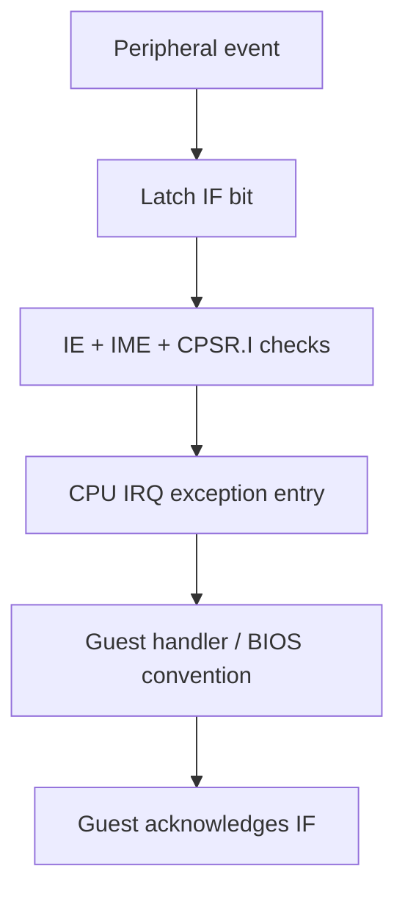

# Interrupts: requests, masks and exception entry

## Before the technical details

An interrupt is a request for the CPU to attend to an event. A request can be pending even when it is not currently allowed through. An enable or mask controls permission; acknowledgement handles a recorded request according to the device rules. C# exceptions and host threads are different concepts. First separate “something happened” from “we can react now.”

## Syntax warm-up

### Open PowerShell and prepare this lesson

Open a PowerShell terminal (an IDE terminal is fine). Run this block once in each new terminal. The path below is your current checkout; if you move the repository, change that first path. All later commands on this page run from this folder, not from the lesson folder.

```powershell
Set-Location "C:\Users\victo\Desktop\RevoAdvance"
if (Test-Path ".work/dotnet10/dotnet.exe") {
    $env:PATH = "$PWD\.work\dotnet10;$env:PATH"
}
dotnet --version
```

Expect a version beginning with `10.`. The conditional uses the local SDK when present and changes PATH only for this terminal. If the command is missing or shows `8.`, complete the [.NET 10 setup](../00-getting-started/before-you-code.md#set-up-and-know-what-success-looks-like) before continuing.

Create the console scratchpad only if it does not already exist:

```powershell
if (-not (Test-Path ".work/SyntaxLab/SyntaxLab.csproj")) {
    dotnet new console --framework net10.0 --output .work/SyntaxLab
}
```

If it already exists, no output from that block is expected. Keep using that project; do not create another project for each example. [Command troubleshooting](../00-getting-started/running-and-testing.md) explains errors and the difference between running and testing.

Each example below is a complete, independent console program. Run one at a time in [SyntaxLab](../00-getting-started/before-you-code.md#a-separate-place-to-try-the-examples). These toy examples teach C#; the emulator implementation remains your exercise.

### Separate a request from permission

**Run this example:** open `.work/SyntaxLab/Program.cs` in your editor, replace its entire contents with the C# block below, and save. Then run this in the PowerShell terminal prepared above:

```powershell
dotnet run --project .work/SyntaxLab/SyntaxLab.csproj
```

Compare the program output with “Expected output” below. After changing an example, save and run the same command again. Do not paste the command into the C# file. This command compiles your saved changes automatically.

```csharp
bool requested = true;
bool allowed = false;
bool canRespond = requested && allowed;
Console.WriteLine(requested);
Console.WriteLine(canRespond);
```

Expected output:

```text
True
False
```

Computing `canRespond` does not erase `requested`. `&&` requires both inputs to be true. This is a two-question analogy, not the GBA interrupt acceptance formula; the hardware has several distinct controls.

### Find overlapping sets of options

**Run this example:** open `.work/SyntaxLab/Program.cs` in your editor, replace its entire contents with the C# block below, and save. Then run this in the PowerShell terminal prepared above:

```powershell
dotnet run --project .work/SyntaxLab/SyntaxLab.csproj
```

Compare the program output with “Expected output” below. After changing an example, save and run the same command again. Do not paste the command into the C# file. This command compiles your saved changes automatically.

```csharp
uint selected = 0b_1010u;
uint available = 0b_1100u;
uint overlap = selected & available;
Console.WriteLine(overlap);
Console.WriteLine(overlap != 0u);
```

Expected output:

```text
8
True
```

AND keeps the option present in both sets: bit 3, worth eight. `!=` means “not equal.” This prepares you to read bit sets without giving you an interrupt controller implementation.

### Try it before implementing

Make the four-row truth table for requested/allowed. Then draw selected and available bits vertically and trace AND by hand. Keep pending state separate from whether the CPU accepts an exception right now.

Continue with the detailed lesson below after you can explain your prediction.


## In the real GBA

A device requests attention by setting a pending interrupt bit. IE (0x04000200) enables sources; IF (0x04000202) records requests; IME (0x04000208) is the master enable. CPU CPSR.I also masks IRQ acceptance. A pending request is not automatically an exception. Writing ones to IF acknowledges those bits; writing zeros does not clear them.



## In our emulator

Inputs are peripheral requests and guest register writes. Output is pending state and an IRQ signal considered by the CPU at a defined point. Entry saves status/return state, uses the IRQ bank, changes control state and vectors through the CPU exception mechanism. Merely calling a host callback bypasses visible guest behavior. BIOS dispatch conventions add software behavior on top of hardware entry; keep those concepts separate.

Interrupt requests can remain pending while masked. HALT wake-up conditions deserve separate tests: waking from HALT and accepting an IRQ are not the same decision and their masks differ. Coordinate this with the scheduler instead of stopping all hardware when the CPU sleeps.

## In C#

A flags representation can describe pending sources, but write-one-to-clear semantics require an operation, not ordinary assignment. Guest IRQ is state evolution; .NET exceptions are for host failures.


## C#/.NET concepts used here

- [Bitwise operations: a mini-course](../csharp-and-dotnet/bitwise-operations.md) — [Microsoft](https://learn.microsoft.com/en-us/dotnet/csharp/language-reference/operators/bitwise-and-shift-operators): AND, OR, XOR, complement and shift behavior.
- [Enums and named states](../csharp-and-dotnet/enums.md) — [Microsoft](https://learn.microsoft.com/en-us/dotnet/csharp/language-reference/builtin-types/enum): Named constants and underlying integral types.
- [Host exceptions and guest exceptions](../csharp-and-dotnet/exceptions.md) — [Microsoft](https://learn.microsoft.com/en-us/dotnet/csharp/fundamentals/exceptions/): Throw, try, catch and finally.

## What you should understand now

- [ ] Pending, enabled and accepted are distinct states.
- [ ] Acknowledgement is a register side effect.

## C#/.NET refresher

Work through the local explanations linked above, then use their paired official references for the named details. Prefer ordinary managed code; optional optimization pages are explicitly marked.

## Your implementation task

Implement pending and enable registers, then test one timer-triggered request and CPU entry. First verify masks and acknowledgement without executing a handler.

## Run and check your own implementation

Use the PowerShell terminal prepared at the top of this page, in the repository root. Write your tests in `tests/Gba.Core.Tests/InterruptTests.cs` with a **public class named `InterruptTests`** and public methods marked `[Fact]` or `[Theory]`. Add `using Xunit;` at the top. The [complete xUnit examples](../csharp-and-dotnet/testing.md#a-complete-fact-example-test-project-only) show the file structure; write the actual test bodies yourself. Test pending versus enabled requests, masking and acknowledgement. Emulator logic belongs in `src/Gba.Core`; the first low-byte practice needs no emulator component.

Save all edited files. Run each command separately, stopping if a command fails:

```powershell
dotnet build GbaEmulator.sln
dotnet test tests/Gba.Core.Tests/Gba.Core.Tests.csproj --list-tests
dotnet test tests/Gba.Core.Tests/Gba.Core.Tests.csproj --filter "FullyQualifiedName~InterruptTests" --logger "console;verbosity=normal"
dotnet test tests/Gba.Core.Tests/Gba.Core.Tests.csproj
```

The build should succeed. The list must include your new test methods. The filtered run must execute your `InterruptTests` cases and report zero failures; the last command runs **all** Core tests to catch regressions. The count depends on the cases you wrote. “No tests available” or “No test matches” is not a pass: check the saved file, public class/method, attribute and filter spelling. If you choose a different class name, change the filter to match it.

After each code or test edit, save and rerun the filtered command. When it passes, run the full test command again. For your first test, deliberately change one expected value, rerun to see a failed assertion, restore the correct value and rerun to see a pass. Do not leave the deliberately wrong expectation in your work. A compiler error must be fixed before you can evaluate assertions. These commands build automatically; do not use `--no-build` while learning because it can execute stale code.

## Definition of done

- A masked request remains pending.
- Acknowledging one source preserves another.
- IRQ entry/return preserve the intended bank and status.

## Common mistakes

- Clearing all IF bits with an ordinary assignment.
- Dropping requests that arrive while disabled.
- Throwing a .NET exception to emulate IRQ.

## Further reading

- [GBATEK interrupts](https://mgba-emu.github.io/gbatek/#gbainterruptcontrol) — IE/IF/IME and HALT conditions.
- [Tonc interrupts](https://gbadev.net/tonc/interrupts.html) — hardware entry versus software handler conventions.

## Next chapter

[Timers: counters driven by guest time](../09-timers/README.md)
