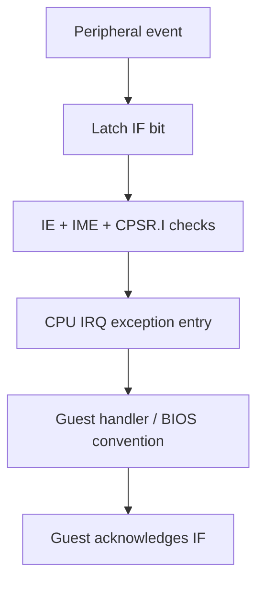

# Interrupts: requests, masks and exception entry

## In the real GBA

A device requests attention by setting a pending interrupt bit. IE (0x04000200) enables sources; IF (0x04000202) records requests; IME (0x04000208) is the master enable. CPU CPSR.I also masks IRQ acceptance. A pending request is not automatically an exception. Writing ones to IF acknowledges those bits; writing zeros does not clear them.

## In our emulator

Inputs are peripheral requests and guest register writes. Output is pending state and an IRQ signal considered by the CPU at a defined point. Entry saves status/return state, uses the IRQ bank, changes control state and vectors through the CPU exception mechanism. Merely calling a host callback bypasses visible guest behavior. BIOS dispatch conventions add software behavior on top of hardware entry; keep those concepts separate.

Interrupt requests can remain pending while masked. HALT wake-up conditions deserve separate tests: waking from HALT and accepting an IRQ are not the same decision and their masks differ. Coordinate this with the scheduler instead of stopping all hardware when the CPU sleeps.

## In C#

A flags representation can describe pending sources, but write-one-to-clear semantics require an operation, not ordinary assignment. Guest IRQ is state evolution; .NET exceptions are for host failures.

## C#/.NET concepts used here

- [Bitwise operations: a mini-course](../csharp-and-dotnet/bitwise-operations.md) — [Microsoft](https://learn.microsoft.com/en-us/dotnet/csharp/language-reference/operators/bitwise-and-shift-operators): AND, OR, XOR, complement and shift behavior.
- [Enums and named states](../csharp-and-dotnet/enums.md) — [Microsoft](https://learn.microsoft.com/en-us/dotnet/csharp/language-reference/builtin-types/enum): Named constants and underlying integral types.
- [Host exceptions and guest exceptions](../csharp-and-dotnet/exceptions.md) — [Microsoft](https://learn.microsoft.com/en-us/dotnet/csharp/fundamentals/exceptions/): Throw, try, catch and finally.

## What you should understand now

- [ ] Pending, enabled and accepted are distinct states.
- [ ] Acknowledgement is a register side effect.

## C#/.NET refresher

Work through the local explanations linked above, then use their paired official references for the named details. Prefer ordinary managed code; optional optimization pages are explicitly marked.

## Your implementation task

Implement pending and enable registers, then test one timer-triggered request and CPU entry. First verify masks and acknowledgement without executing a handler.

## Definition of done

- A masked request remains pending.
- Acknowledging one source preserves another.
- IRQ entry/return preserve the intended bank and status.

## Common mistakes

- Clearing all IF bits with an ordinary assignment.
- Dropping requests that arrive while disabled.
- Throwing a .NET exception to emulate IRQ.

## Further reading

- [GBATEK interrupts](https://mgba-emu.github.io/gbatek/#gbainterruptcontrol) — IE/IF/IME and HALT conditions.
- [Tonc interrupts](https://gbadev.net/tonc/interrupts.html) — hardware entry versus software handler conventions.

## Next chapter

[Timers: counters driven by guest time](../09-timers/README.md)
