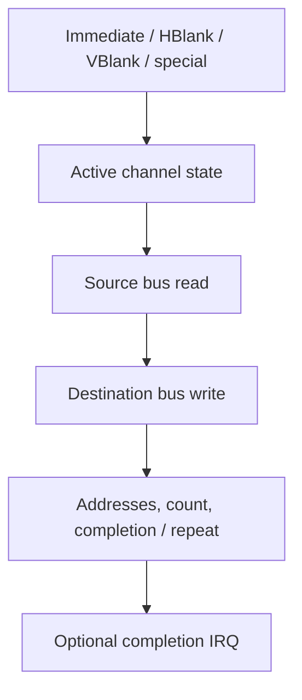

# DMA: timed transfers with bus ownership

## In the real GBA

Four DMA channels transfer halfwords or words from source to destination. Their registers occupy 0x040000B0–0x040000DE. Configuration includes addresses, transfer count, width, address-control modes, repeat, trigger and IRQ. Channels have different address/count restrictions and special uses; DMA0 has highest priority.

## In our emulator

Store programmed configuration separately from active latched addresses/counts. Inputs are register writes and scheduler triggers. Outputs are bus operations, consumed cycles and optional completion requests. While DMA owns the bus, CPU execution is delayed, but other timed hardware continues.

Start with immediate transfers and fixed constraints. Later add decrement/fixed destination, reload, repeat and display triggers. A zero programmed count encodes a maximum count (channel-dependent), not an empty transfer. FIFO DMA has special count/width/trigger behavior and belongs with audio integration.

## In C#

Array.Copy cannot stand in for all DMA: destinations can be I/O, and each transfer has bus side effects and timing. Readable state and explicit transfer progression come first; no asynchronous Task is required to represent hardware concurrency.

## C#/.NET concepts used here

- [Integer types, binary and hexadecimal](../csharp-and-dotnet/integer-types.md) — [Microsoft](https://learn.microsoft.com/en-us/dotnet/csharp/language-reference/builtin-types/integral-numeric-types): Ranges, literals and signedness.
- [Enums and named states](../csharp-and-dotnet/enums.md) — [Microsoft](https://learn.microsoft.com/en-us/dotnet/csharp/language-reference/builtin-types/enum): Named constants and underlying integral types.
- [Structs versus classes](../csharp-and-dotnet/structs-vs-classes.md) — [Microsoft](https://learn.microsoft.com/en-us/dotnet/csharp/language-reference/builtin-types/struct): Value copying versus shared identity.

## What you should understand now

- [ ] Programmed and active state are different.
- [ ] A transfer consumes shared bus time.

## C#/.NET refresher

Work through the local explanations linked above, then use their paired official references for the named details. Prefer ordinary managed code; optional optimization pages are explicitly marked.

## Your implementation task

Implement one immediate transfer case via your existing bus. Add count-zero and address-control tests before repeat or FIFO behavior.

## Definition of done

- Destination bytes and final active addresses match hand calculations.
- CPU stalls while timers/display advance.
- Completion acknowledgement and repeat state follow the chosen case.

## Common mistakes

- Using a host parallel thread as DMA.
- Copying directly between arrays and bypassing I/O.
- Treating every channel count field identically.

## Further reading

- [GBATEK DMA](https://mgba-emu.github.io/gbatek/#gbadmatransfers) — channel restrictions and special trigger modes.
- [Tonc DMA](https://gbadev.net/tonc/dma.html) — address control and practical transfer use.

## Next chapter

[Keypad: host buttons become guest bits](../11-input/README.md)
