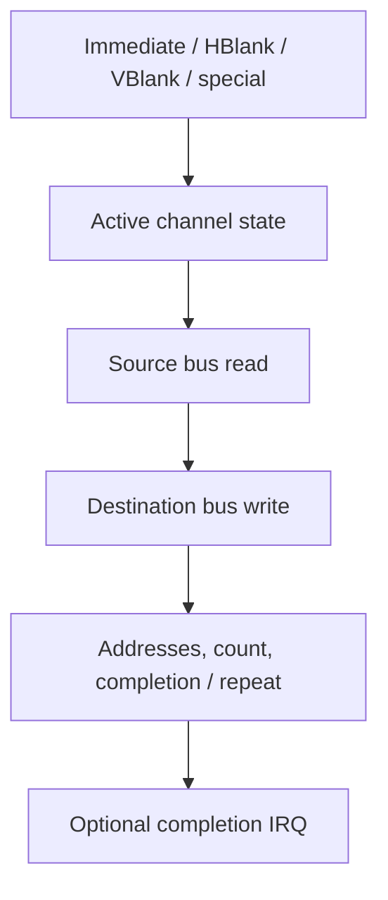

# DMA: timed transfers with bus ownership

## Before the technical details

DMA means direct memory access: hardware carries out transfers after software configures a job. The important questions are source, destination, amount, trigger and elapsed guest time. A host array copy cannot supply the full hardware behavior. Begin with the syntax for counted work and understand what a count measures.

## Syntax warm-up

### Open PowerShell and prepare this lesson

Open a PowerShell terminal (an IDE terminal is fine). Run this block once in each new terminal. The path below is your current checkout; if you move the repository, change that first path. All later commands on this page run from this folder, not from the lesson folder.

```powershell
Set-Location "C:\Users\victo\Desktop\RevoAdvance"
if (Test-Path ".work/dotnet10/dotnet.exe") {
    $env:PATH = "$PWD\.work\dotnet10;$env:PATH"
}
dotnet --version
```

Expect a version beginning with `10.`. The conditional uses the local SDK when present and changes PATH only for this terminal. If the command is missing or shows `8.`, complete the [.NET 10 setup](../00-getting-started/before-you-code.md#set-up-and-know-what-success-looks-like) before continuing.

Create the console scratchpad only if it does not already exist:

```powershell
if (-not (Test-Path ".work/SyntaxLab/SyntaxLab.csproj")) {
    dotnet new console --framework net10.0 --output .work/SyntaxLab
}
```

If it already exists, no output from that block is expected. Keep using that project; do not create another project for each example. [Command troubleshooting](../00-getting-started/running-and-testing.md) explains errors and the difference between running and testing.

Each example below is a complete, independent console program. Run one at a time in [SyntaxLab](../00-getting-started/before-you-code.md#a-separate-place-to-try-the-examples). These toy examples teach C#; the emulator implementation remains your exercise.

### Trace a counted loop

**Run this example:** open `.work/SyntaxLab/Program.cs` in your editor, replace its entire contents with the C# block below, and save. Then run this in the PowerShell terminal prepared above:

```powershell
dotnet run --project .work/SyntaxLab/SyntaxLab.csproj
```

Compare the program output with “Expected output” below. After changing an example, save and run the same command again. Do not paste the command into the C# file. This command compiles your saved changes automatically.

```csharp
for (int item = 0; item < 3; item++)
{
    Console.WriteLine(item);
}
```

Expected output:

```text
0
1
2
```

The `for` header has initialization, condition and update separated by semicolons. The body runs only while the condition holds. A count of three gives three iterations, despite the last printed index being two.

### Distinguish element count from byte count

**Run this example:** open `.work/SyntaxLab/Program.cs` in your editor, replace its entire contents with the C# block below, and save. Then run this in the PowerShell terminal prepared above:

```powershell
dotnet run --project .work/SyntaxLab/SyntaxLab.csproj
```

Compare the program output with “Expected output” below. After changing an example, save and run the same command again. Do not paste the command into the C# file. This command compiles your saved changes automatically.

```csharp
int parcels = 3;
int bytesPerParcel = 2;
int totalBytes = parcels * bytesPerParcel;
Console.WriteLine(totalBytes);
```

Expected output:

```text
6
```

An element count needs a unit. Three two-byte elements are six bytes. Naming the units makes later transfer-width reasoning easier; this arithmetic does not describe DMA timing or device side effects.

### Try it before implementing

Trace loop counts zero, one and three on paper. Make a toy job card with source, destination, units per element and element count. In the real chapter, add trigger and bus ownership before writing the transfer logic.

Continue with the detailed lesson below after you can explain your prediction.


## In the real GBA

Four DMA channels transfer halfwords or words from source to destination. Their registers occupy 0x040000B0–0x040000DE. Configuration includes addresses, transfer count, width, address-control modes, repeat, trigger and IRQ. Channels have different address/count restrictions and special uses; DMA0 has highest priority.



## In our emulator

Store programmed configuration separately from active latched addresses/counts. Inputs are register writes and scheduler triggers. Outputs are bus operations, consumed cycles and optional completion requests. While DMA owns the bus, CPU execution is delayed, but other timed hardware continues.

Start with immediate transfers and fixed constraints. Later add decrement/fixed destination, reload, repeat and display triggers. A zero programmed count encodes a maximum count (channel-dependent), not an empty transfer. FIFO DMA has special count/width/trigger behavior and belongs with audio integration.

## In C#

Array.Copy cannot stand in for all DMA: destinations can be I/O, and each transfer has bus side effects and timing. Readable state and explicit transfer progression come first; no asynchronous Task is required to represent hardware concurrency.


## C#/.NET concepts used here

- [Integer types, binary and hexadecimal](../csharp-and-dotnet/integer-types.md) — [Microsoft](https://learn.microsoft.com/en-us/dotnet/csharp/language-reference/builtin-types/integral-numeric-types): Ranges, literals and signedness.
- [Enums and named states](../csharp-and-dotnet/enums.md) — [Microsoft](https://learn.microsoft.com/en-us/dotnet/csharp/language-reference/builtin-types/enum): Named constants and underlying integral types.
- [Structs versus classes](../csharp-and-dotnet/structs-vs-classes.md) — [Microsoft](https://learn.microsoft.com/en-us/dotnet/csharp/language-reference/builtin-types/struct): Value copying versus shared identity.

## What you should understand now

- [ ] Programmed and active state are different.
- [ ] A transfer consumes shared bus time.

## C#/.NET refresher

Work through the local explanations linked above, then use their paired official references for the named details. Prefer ordinary managed code; optional optimization pages are explicitly marked.

## Your implementation task

Implement one immediate transfer case via your existing bus. Add count-zero and address-control tests before repeat or FIFO behavior.

## Run and check your own implementation

Use the PowerShell terminal prepared at the top of this page, in the repository root. Write your tests in `tests/Gba.Core.Tests/DmaTests.cs` with a **public class named `DmaTests`** and public methods marked `[Fact]` or `[Theory]`. Add `using Xunit;` at the top. The [complete xUnit examples](../csharp-and-dotnet/testing.md#a-complete-fact-example-test-project-only) show the file structure; write the actual test bodies yourself. Test transfer widths, source/destination behavior, trigger and guest timing. Emulator logic belongs in `src/Gba.Core`; the first low-byte practice needs no emulator component.

Save all edited files. Run each command separately, stopping if a command fails:

```powershell
dotnet build GbaEmulator.sln
dotnet test tests/Gba.Core.Tests/Gba.Core.Tests.csproj --list-tests
dotnet test tests/Gba.Core.Tests/Gba.Core.Tests.csproj --filter "FullyQualifiedName~DmaTests" --logger "console;verbosity=normal"
dotnet test tests/Gba.Core.Tests/Gba.Core.Tests.csproj
```

The build should succeed. The list must include your new test methods. The filtered run must execute your `DmaTests` cases and report zero failures; the last command runs **all** Core tests to catch regressions. The count depends on the cases you wrote. “No tests available” or “No test matches” is not a pass: check the saved file, public class/method, attribute and filter spelling. If you choose a different class name, change the filter to match it.

After each code or test edit, save and rerun the filtered command. When it passes, run the full test command again. For your first test, deliberately change one expected value, rerun to see a failed assertion, restore the correct value and rerun to see a pass. Do not leave the deliberately wrong expectation in your work. A compiler error must be fixed before you can evaluate assertions. These commands build automatically; do not use `--no-build` while learning because it can execute stale code.

## Definition of done

- Destination bytes and final active addresses match hand calculations.
- CPU stalls while timers/display advance.
- Completion acknowledgement and repeat state follow the chosen case.

## Common mistakes

- Using a host parallel thread as DMA.
- Copying directly between arrays and bypassing I/O.
- Treating every channel count field identically.

## Further reading

- [GBATEK DMA](https://mgba-emu.github.io/gbatek/#gbadmatransfers) — channel restrictions and special trigger modes.
- [Tonc DMA](https://gbadev.net/tonc/dma.html) — address control and practical transfer use.

## Next chapter

[Keypad: host buttons become guest bits](../11-input/README.md)
