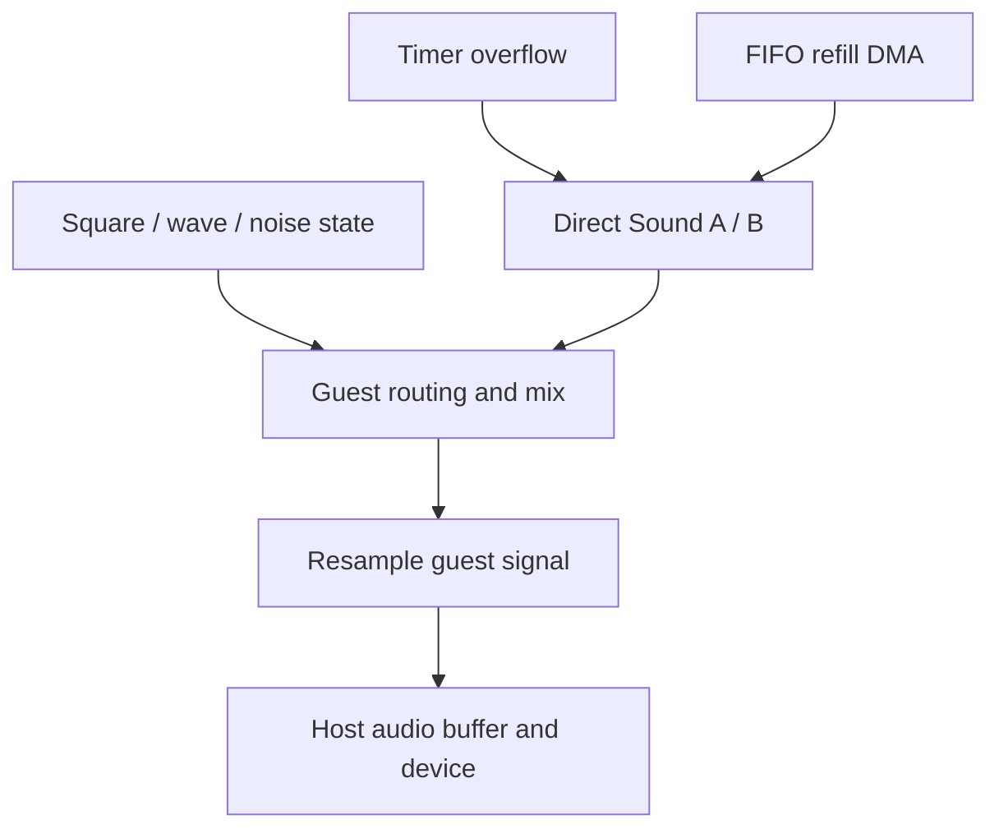

# Audio: guest clocks become host samples

## In the real GBA

The GBA sound hardware combines four legacy channels (two square-wave channels, wave playback and noise) with two Direct Sound FIFOs. Channel state includes frequency/phase, length, envelope and routing controls. Direct Sound consumes signed 8-bit samples on selected timer overflows and can request DMA refill as its FIFO runs low.

Sound registers span roughly 0x04000060–0x040000A7, including channel controls, SOUNDCNT registers, bias, wave RAM and FIFO_A/FIFO_B at 0x040000A0/0x040000A4. Not every address is ordinary readable/writable storage.

## In our emulator

Core advances channel/FIFO state on guest time and produces samples. Desktop sends them to a chosen native audio output backend (no SDL). Device sample rate and callbacks do not define the emulated timer clock. Conversion/resampling bridges those timelines; uncontrolled buffer growth causes latency, and underruns cause clicks.

Start with one reproducible tone or one timer-driven FIFO sample stream. Then add envelopes/noise/wave and routing. Label simplified mixing clearly until you implement the hardware DAC/bias behavior. Do not use an audible result alone as a numerical correctness test.

## In C#

Signed sample interpretation differs from unsigned storage bytes. Persistent arrays with bounded producer/consumer positions suit audio buffers. Avoid per-sample allocations. Establish whether the host copies or retains a buffer before Core reuses it; a ReadOnlySpan does not freeze backing storage.

## C#/.NET concepts used here

- [Integer types, binary and hexadecimal](../csharp-and-dotnet/integer-types.md) — [Microsoft](https://learn.microsoft.com/en-us/dotnet/csharp/language-reference/builtin-types/integral-numeric-types): Ranges, literals and signedness.
- [Arrays, spans and byte order](../csharp-and-dotnet/arrays-and-spans.md) — [Microsoft](https://learn.microsoft.com/en-us/dotnet/csharp/language-reference/builtin-types/arrays): Zero-based indexing and array reference semantics.
- [Allocations and garbage collection](../csharp-and-dotnet/allocations-and-gc.md) — [Microsoft](https://learn.microsoft.com/en-us/dotnet/standard/garbage-collection/fundamentals): Reachability, collection and generations.

## What you should understand now

- [ ] Guest generation and host playback run on different clocks.
- [ ] FIFOs connect timers, DMA and sound.

## C#/.NET refresher

Work through the local explanations linked above, then use their paired official references for the named details. Prefer ordinary managed code; optional optimization pages are explicitly marked.

## Your implementation task

Implement one sound source in Core and verify its event/sample sequence without an audio device. Then connect host output and observe buffering at a fixed target latency.

## Definition of done

- A fixed guest-cycle input produces the same sample sequence.
- FIFO consumption and refill timing are tested.
- A sustained tone plays without accumulating latency or steady underruns.

## Common mistakes

- Driving guest timers with audio callbacks.
- Reading signed samples as unsigned amplitudes.
- Reusing a buffer while the native device still owns it.

## Further reading

- [GBATEK sound](https://mgba-emu.github.io/gbatek/#gbasoundcontroller) — channel, FIFO and mixing registers.
- [Tonc sound](https://gbadev.net/tonc/sndsqr.html) — orientation to legacy versus Direct Sound.

## Next chapter

[One guest timeline](../14-timing-and-scheduling/README.md)
