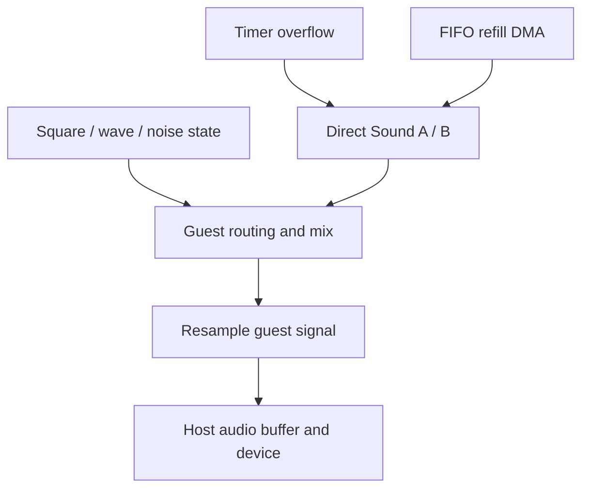

# Audio: guest clocks become host samples

## Before the technical details

A sample is a numeric measurement of a signal at a moment. A stream of samples becomes sound when a host device plays it at a sample rate. A FIFO is a queue where the first value inserted is the first removed. Guest sound generation and host playback have separate clocks. Begin with signs and queue order; no audio device is needed.

## Syntax warm-up

### Open PowerShell and prepare this lesson

Open a PowerShell terminal (an IDE terminal is fine). Run this block once in each new terminal. The path below is your current checkout; if you move the repository, change that first path. All later commands on this page run from this folder, not from the lesson folder.

```powershell
Set-Location "C:\Users\victo\Desktop\RevoAdvance"
if (Test-Path ".work/dotnet10/dotnet.exe") {
    $env:PATH = "$PWD\.work\dotnet10;$env:PATH"
}
dotnet --version
```

Expect a version beginning with `10.`. The conditional uses the local SDK when present and changes PATH only for this terminal. If the command is missing or shows `8.`, complete the [.NET 10 setup](../00-getting-started/before-you-code.md#set-up-and-know-what-success-looks-like) before continuing.

Create the console scratchpad only if it does not already exist:

```powershell
if (-not (Test-Path ".work/SyntaxLab/SyntaxLab.csproj")) {
    dotnet new console --framework net10.0 --output .work/SyntaxLab
}
```

If it already exists, no output from that block is expected. Keep using that project; do not create another project for each example. [Command troubleshooting](../00-getting-started/running-and-testing.md) explains errors and the difference between running and testing.

Each example below is a complete, independent console program. Run one at a time in [SyntaxLab](../00-getting-started/before-you-code.md#a-separate-place-to-try-the-examples). These toy examples teach C#; the emulator implementation remains your exercise.

### Interpret a byte with a signed type

**Run this example:** open `.work/SyntaxLab/Program.cs` in your editor, replace its entire contents with the C# block below, and save. Then run this in the PowerShell terminal prepared above:

```powershell
dotnet run --project .work/SyntaxLab/SyntaxLab.csproj
```

Compare the program output with “Expected output” below. After changing an example, save and run the same command again. Do not paste the command into the C# file. This command compiles your saved changes automatically.

```csharp
byte stored = 0xFC;
sbyte signed = unchecked((sbyte)stored);
Console.WriteLine(stored);
Console.WriteLine(signed);
```

Expected output:

```text
252
-4
```

The same eight bits can represent unsigned 252 or signed -4. `unchecked` makes the narrowing conversion intentional even in a checked context. This is a numeric interpretation example, not a mixer or an audio output routine.

### Observe first-in, first-out order

**Run this example:** open `.work/SyntaxLab/Program.cs` in your editor, replace its entire contents with the C# block below, and save. Then run this in the PowerShell terminal prepared above:

```powershell
dotnet run --project .work/SyntaxLab/SyntaxLab.csproj
```

Compare the program output with “Expected output” below. After changing an example, save and run the same command again. Do not paste the command into the C# file. This command compiles your saved changes automatically.

```csharp
Queue<int> waiting = new Queue<int>();
waiting.Enqueue(12);
waiting.Enqueue(20);
Console.WriteLine(waiting.Dequeue());
Console.WriteLine(waiting.Count);
```

Expected output:

```text
12
1
```

`Queue<int>` is a collection of integers. `Enqueue` adds and `Dequeue` removes the oldest item. A generic queue teaches order; it does not automatically enforce the GBA FIFO capacity, refill thresholds or timing.

### Try it before implementing

Predict signed interpretations for 0x00, 0x7F and 0x80. Draw a three-item queue and cross off two removals. Then read which guest event consumes an audio sample; do not drive it from desktop callback timing.

Continue with the detailed lesson below after you can explain your prediction.


## In the real GBA

The GBA sound hardware combines four legacy channels (two square-wave channels, wave playback and noise) with two Direct Sound FIFOs. Channel state includes frequency/phase, length, envelope and routing controls. Direct Sound consumes signed 8-bit samples on selected timer overflows and can request DMA refill as its FIFO runs low.

Sound registers span roughly 0x04000060–0x040000A7, including channel controls, SOUNDCNT registers, bias, wave RAM and FIFO_A/FIFO_B at 0x040000A0/0x040000A4. Not every address is ordinary readable/writable storage.



## In our emulator

Core advances channel/FIFO state on guest time and produces samples. Desktop sends them to a chosen native audio output backend (no SDL). Device sample rate and callbacks do not define the emulated timer clock. Conversion/resampling bridges those timelines; uncontrolled buffer growth causes latency, and underruns cause clicks.

Start with one reproducible tone or one timer-driven FIFO sample stream. Then add envelopes/noise/wave and routing. Label simplified mixing clearly until you implement the hardware DAC/bias behavior. Do not use an audible result alone as a numerical correctness test.

## In C#

Signed sample interpretation differs from unsigned storage bytes. Persistent arrays with bounded producer/consumer positions suit audio buffers. Avoid per-sample allocations. Establish whether the host copies or retains a buffer before Core reuses it; a ReadOnlySpan does not freeze backing storage.


## C#/.NET concepts used here

- [Integer types, binary and hexadecimal](../csharp-and-dotnet/integer-types.md) — [Microsoft](https://learn.microsoft.com/en-us/dotnet/csharp/language-reference/builtin-types/integral-numeric-types): Ranges, literals and signedness.
- [Arrays, spans and byte order](../csharp-and-dotnet/arrays-and-spans.md) — [Microsoft](https://learn.microsoft.com/en-us/dotnet/csharp/language-reference/builtin-types/arrays): Zero-based indexing and array reference semantics.
- [Allocations and garbage collection](../csharp-and-dotnet/allocations-and-gc.md) — [Microsoft](https://learn.microsoft.com/en-us/dotnet/standard/garbage-collection/fundamentals): Reachability, collection and generations.

## What you should understand now

- [ ] Guest generation and host playback run on different clocks.
- [ ] FIFOs connect timers, DMA and sound.

## C#/.NET refresher

Work through the local explanations linked above, then use their paired official references for the named details. Prefer ordinary managed code; optional optimization pages are explicitly marked.

## Your implementation task

Implement one sound source in Core and verify its event/sample sequence without an audio device. Then connect host output and observe buffering at a fixed target latency.

## Run and check your own implementation

Use the PowerShell terminal prepared at the top of this page, in the repository root. Write your tests in `tests/Gba.Core.Tests/AudioTests.cs` with a **public class named `AudioTests`** and public methods marked `[Fact]` or `[Theory]`. Add `using Xunit;` at the top. The [complete xUnit examples](../csharp-and-dotnet/testing.md#a-complete-fact-example-test-project-only) show the file structure; write the actual test bodies yourself. Test repeatable numeric samples and implemented FIFO/timer behavior without an audio device. Emulator logic belongs in `src/Gba.Core`; the first low-byte practice needs no emulator component.

Save all edited files. Run each command separately, stopping if a command fails:

```powershell
dotnet build GbaEmulator.sln
dotnet test tests/Gba.Core.Tests/Gba.Core.Tests.csproj --list-tests
dotnet test tests/Gba.Core.Tests/Gba.Core.Tests.csproj --filter "FullyQualifiedName~AudioTests" --logger "console;verbosity=normal"
dotnet test tests/Gba.Core.Tests/Gba.Core.Tests.csproj
```

The build should succeed. The list must include your new test methods. The filtered run must execute your `AudioTests` cases and report zero failures; the last command runs **all** Core tests to catch regressions. The count depends on the cases you wrote. “No tests available” or “No test matches” is not a pass: check the saved file, public class/method, attribute and filter spelling. If you choose a different class name, change the filter to match it.

After each code or test edit, save and rerun the filtered command. When it passes, run the full test command again. For your first test, deliberately change one expected value, rerun to see a failed assertion, restore the correct value and rerun to see a pass. Do not leave the deliberately wrong expectation in your work. A compiler error must be fixed before you can evaluate assertions. These commands build automatically; do not use `--no-build` while learning because it can execute stale code.

## Definition of done

- A fixed guest-cycle input produces the same sample sequence.
- FIFO consumption and refill timing are tested.
- A sustained tone plays without accumulating latency or steady underruns.

## Common mistakes

- Driving guest timers with audio callbacks.
- Reading signed samples as unsigned amplitudes.
- Reusing a buffer while the native device still owns it.

## Further reading

- [GBATEK sound](https://mgba-emu.github.io/gbatek/#gbasoundcontroller) — channel, FIFO and mixing registers.
- [Tonc sound](https://gbadev.net/tonc/sndsqr.html) — orientation to legacy versus Direct Sound.

## Next chapter

[One guest timeline](../14-timing-and-scheduling/README.md)
