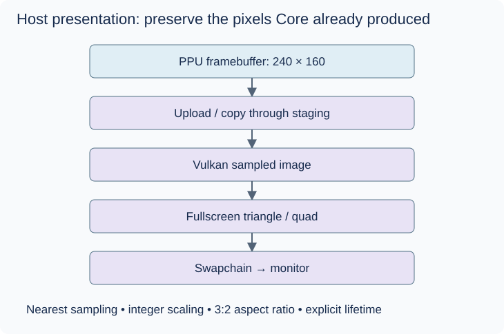

# Vulkan: presenting the finished framebuffer

## Before the technical details

This is a later lesson. You can learn the CPU and produce test pixels before learning Vulkan. The GPU is your PC graphics processor. An image stores pixels, a queue accepts GPU work, and a swapchain provides images for presentation. Creating resources, submitting work and waiting for completion are distinct actions. Silk.NET exposes the API to C#; GLFW supplies the planned window/input backend. Start with layout and lifetime, not a wall of native calls.

## Syntax warm-up

### Open PowerShell and prepare this lesson

Open a PowerShell terminal (an IDE terminal is fine). Run this block once in each new terminal. The path below is your current checkout; if you move the repository, change that first path. All later commands on this page run from this folder, not from the lesson folder.

```powershell
Set-Location "C:\Users\victo\Desktop\RevoAdvance"
if (Test-Path ".work/dotnet10/dotnet.exe") {
    $env:PATH = "$PWD\.work\dotnet10;$env:PATH"
}
dotnet --version
```

Expect a version beginning with `10.`. The conditional uses the local SDK when present and changes PATH only for this terminal. If the command is missing or shows `8.`, complete the [.NET 10 setup](../00-getting-started/before-you-code.md#set-up-and-know-what-success-looks-like) before continuing.

Create the console scratchpad only if it does not already exist:

```powershell
if (-not (Test-Path ".work/SyntaxLab/SyntaxLab.csproj")) {
    dotnet new console --framework net10.0 --output .work/SyntaxLab
}
```

If it already exists, no output from that block is expected. Keep using that project; do not create another project for each example. [Command troubleshooting](../00-getting-started/running-and-testing.md) explains errors and the difference between running and testing.

Each example below is a complete, independent console program. Run one at a time in [SyntaxLab](../00-getting-started/before-you-code.md#a-separate-place-to-try-the-examples). These toy examples teach C#; the emulator implementation remains your exercise.

### Calculate a tiny image storage budget

**Run this example:** open `.work/SyntaxLab/Program.cs` in your editor, replace its entire contents with the C# block below, and save. Then run this in the PowerShell terminal prepared above:

```powershell
dotnet run --project .work/SyntaxLab/SyntaxLab.csproj
```

Compare the program output with “Expected output” below. After changing an example, save and run the same command again. Do not paste the command into the C# file. This command compiles your saved changes automatically.

```csharp
int width = 4;
int height = 3;
int bytesPerPixel = 4;
int rowBytes = width * bytesPerPixel;
Console.WriteLine(rowBytes);
Console.WriteLine(rowBytes * height);
```

Expected output:

```text
16
48
```

For this tightly packed toy image, each row needs sixteen bytes and the image needs forty-eight. Row stride is the distance between row starts; an API can require padding, so do not assume every real image uses this exact layout.

### Observe deterministic cleanup with a managed stream

**Run this example:** open `.work/SyntaxLab/Program.cs` in your editor, replace its entire contents with the C# block below, and save. Then run this in the PowerShell terminal prepared above:

```powershell
dotnet run --project .work/SyntaxLab/SyntaxLab.csproj
```

Compare the program output with “Expected output” below. After changing an example, save and run the same command again. Do not paste the command into the C# file. This command compiles your saved changes automatically.

```csharp
using System.IO;

using (MemoryStream stream = new MemoryStream())
{
    stream.WriteByte(7);
    Console.WriteLine(stream.Length);
}
Console.WriteLine("scope finished");
```

Expected output:

```text
1
scope finished
```

The first `using` imports a namespace. The `using (...)` block disposes the resource when the block is exited. It illustrates lifetime, but Vulkan resources also require explicit ownership and completion of GPU work before destruction. This stream has no GPU or disk effects.

### Try it before implementing

Sketch who creates, uses and releases a resource. Then list window, surface, device, swapchain and upload as separate reading topics. Follow the synthetic-image exercise only after those names make sense; no Vulkan implementation is supplied.

Continue with the detailed lesson below after you can explain your prediction.


## The boundary

Vulkan is a host API, not GBA hardware. The PPU has already decided the pixel colours. Desktop uploads that result and presents it. Core remains testable with no window, driver or GPU. A 240 × 160 image contains only 38,400 pixels; even RGBA8 is 153,600 bytes per frame, so this is a very small GPU workload. API correctness and ownership matter more than elaborate rendering techniques.



## First presentation experiment

Start with a synthetic colour grid in Desktop, independent of the PPU. Learn window/surface creation, device/queues, swapchain, image upload, sampling and presentation in that order. A fullscreen triangle or quad samples the uploaded image. Use a nearest-neighbour sampler so adjacent texels are not blended. Integer scale factors (2×, 3×, etc.) give uniform pixel sizes; letterbox to preserve the 3:2 aspect ratio. When the window is too small, choose an explicit downscale policy.

Then connect Core's framebuffer with a documented pixel format, row stride, ownership and completion boundary. Staging buffers and GPU images have different memory requirements. Image layout transitions, command submission and synchronization are required even for this small texture. Keep CPU/GPU writes from racing; wait for in-flight use before recycling or destroying resources. Handle resize, minimized windows and swapchain recreation.

## Silk.NET and no SDL

The intended path is Silk.NET Vulkan bindings with a GLFW window/input backend. Packages are deliberately deferred. At that milestone inspect the current stable packages `Silk.NET.Vulkan`, `Silk.NET.Windowing.Glfw` and `Silk.NET.Input.Glfw`, plus required abstractions, rather than accepting a backend-agnostic bundle blindly. Verify the dependency graph and shipped native assets contain no SDL. GLFW is a native library accessed from C#; you do not write C++.

```text
Native VkImage handle → Silk.NET typed handle struct → value, not ownership
Native create-info*  → pointer/ref binding parameter → unsafe / ref / lifetime
Native flags        → binding enum                  → bitwise combinations
Native destroy call → explicit binding call         → deterministic cleanup
```

Bindings translate native declarations into C# signatures. They do not turn Vulkan into a managed scene graph or automatically manage GPU synchronization. Exact overloads vary with package version: read the selected binding signature. Only enable AllowUnsafeBlocks in Desktop once required and after the pointer refresher.

Optional later shaders may emulate original GBA LCD, GBA SP display characteristics, colour correction or ghosting. Keep them after faithful framebuffer output and playable-game milestones. Host audio uses a separate non-SDL backend; Vulkan does not output sound.


## C#/.NET concepts used here

- [Unsafe code and pointers](../csharp-and-dotnet/unsafe-and-pointers.md) — [Microsoft](https://learn.microsoft.com/en-us/dotnet/csharp/language-reference/unsafe-code): Unsafe contexts, pointers and fixed.
- [Native interop and resource lifetime](../csharp-and-dotnet/native-interop.md) — [Microsoft](https://learn.microsoft.com/en-us/dotnet/standard/native-interop/): Marshalling, ABI and native ownership.
- [Structs versus classes](../csharp-and-dotnet/structs-vs-classes.md) — [Microsoft](https://learn.microsoft.com/en-us/dotnet/csharp/language-reference/builtin-types/struct): Value copying versus shared identity.
- [Arrays, spans and byte order](../csharp-and-dotnet/arrays-and-spans.md) — [Microsoft](https://learn.microsoft.com/en-us/dotnet/csharp/language-reference/builtin-types/arrays): Zero-based indexing and array reference semantics.

## What you should understand now

- [ ] The framebuffer is a contract between Core and Desktop.
- [ ] Native handles need lifetime and synchronization policies.

## C#/.NET refresher

Work through the local explanations linked above, then use their paired official references for the named details. Prefer ordinary managed code; optional optimization pages are explicitly marked.

## Your implementation task

Build the synthetic host presentation yourself, then connect the PPU buffer. No Vulkan implementation is supplied here.

## Run and check your own implementation

Use the repository-root PowerShell terminal prepared above. Save your changes and run these separately before the manual host check:

```powershell
dotnet build GbaEmulator.sln
dotnet test tests/Gba.Core.Tests/Gba.Core.Tests.csproj
```

Expect a successful build and zero failures in the Core tests you have written. The untouched scaffold has no tests, so an empty test result proves no behavior. These tests do not launch or validate the desktop UI.

Implement the synthetic-grid host exercise in `src/Gba.Desktop`, then run:

```powershell
dotnet run --project src/Gba.Desktop/Gba.Desktop.csproj
```

Before you implement the host, this prints only the scaffold message and exits. After you implement it, expect your grid window. Inspect channels, orientation and scaling; resize, minimize/restore, then close it. The terminal should return to its prompt. Vulkan validation must be configured in your own host setup at this later milestone; `dotnet test` does not enable it or prove GPU lifetime correctness. The core numeric image checks remain separate from this manual window check.

After changes, save and repeat the same commands and manual steps. Record what you actually observed, including any feature you have not implemented yet.

## Definition of done

- A colour grid appears with correct channels, orientation and nearest sampling.
- Integer scaling preserves aspect ratio.
- Resize/close succeeds with Vulkan validation enabled and no resource-lifetime errors.
- Core still builds without any Silk.NET package.

## Common mistakes

- Making the PPU create Vulkan textures.
- Assuming a fixed pointer remains valid after its scope.
- Destroying in-flight GPU resources or accidentally pulling in SDL packages.

## Further reading

- [Khronos tutorial](https://docs.vulkan.org/tutorial/latest/00_Introduction.html) — concepts and lifecycle; translate concepts rather than copy its C++.
- [Silk.NET documentation](https://dotnet.github.io/Silk.NET/docs/) — binding model and package guidance.
- [Silk.NET backends](https://dotnet.github.io/Silk.NET/docs/hlu/troubleshooting/) — GLFW backend/platform support.

## Next chapter

[Evidence before game compatibility](../16-testing/README.md)
