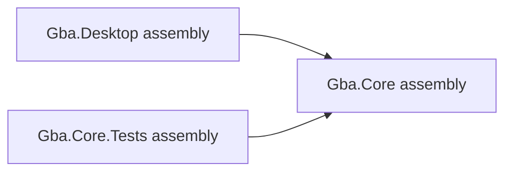

# Projects, assemblies and the .NET CLI

## Before the technical details

If the tooling feels unfamiliar, first read [the stack introduction](../00-getting-started/before-you-code.md). A terminal command tells a tool what to do; C# statements go in `.cs` files; XML settings go in `.csproj` files. A solution groups projects, but only an executable project has an entry point you can run.

## Syntax warm-up

### Open PowerShell and prepare this lesson

Open a PowerShell terminal (an IDE terminal is fine). Run this block once in each new terminal. The path below is your current checkout; if you move the repository, change that first path. All later commands on this page run from this folder, not from the lesson folder.

```powershell
Set-Location "C:\Users\victo\Desktop\RevoAdvance"
if (Test-Path ".work/dotnet10/dotnet.exe") {
    $env:PATH = "$PWD\.work\dotnet10;$env:PATH"
}
dotnet --version
```

Expect a version beginning with `10.`. The conditional uses the local SDK when present and changes PATH only for this terminal. If the command is missing or shows `8.`, complete the [.NET 10 setup](../00-getting-started/before-you-code.md#set-up-and-know-what-success-looks-like) before continuing.

Create the console scratchpad only if it does not already exist:

```powershell
if (-not (Test-Path ".work/SyntaxLab/SyntaxLab.csproj")) {
    dotnet new console --framework net10.0 --output .work/SyntaxLab
}
```

If it already exists, no output from that block is expected. Keep using that project; do not create another project for each example. [Command troubleshooting](../00-getting-started/running-and-testing.md) explains errors and the difference between running and testing.

Each example below is a complete, independent console program. Run one at a time in [SyntaxLab](../00-getting-started/before-you-code.md#a-separate-place-to-try-the-examples). These toy examples teach C#; the emulator implementation remains your exercise.

### See what top-level statements replace

**Run this example:** open `.work/SyntaxLab/Program.cs` in your editor, replace its entire contents with the C# block below, and save. Then run this in the PowerShell terminal prepared above:

```powershell
dotnet run --project .work/SyntaxLab/SyntaxLab.csproj
```

Compare the program output with “Expected output” below. After changing an example, save and run the same command again. Do not paste the command into the C# file. This command compiles your saved changes automatically.

```csharp
using System;

class Program
{
    static void Main()
    {
        Console.WriteLine("Practice app");
    }
}
```

Expected output:

```text
Practice app
```

This is a complete alternative `Program.cs` with an explicit entry method. `static` means no Program instance is required. `void` means Main returns no value here. Replace the entire scratch file when trying it: do not leave earlier top-level statements alongside this entry point.

### Try it before implementing

Compare this with a file containing only `Console.WriteLine("Practice app");`. Both can be complete console programs. Next inspect the real three project files and name which produces Core, which runs, and which discovers tests.

Continue with the detailed lesson below after you can explain your prediction.


The `.sln` file groups projects for tools; it is not a compiled program. Each `.csproj` is an XML build recipe. A project usually produces an assembly (a `.dll`) containing compiled types and metadata. A namespace groups type names logically and can span files; it is not itself an assembly or folder.

```xml
<Project Sdk="Microsoft.NET.Sdk">
  <PropertyGroup>
    <TargetFramework>net10.0</TargetFramework>
    <Nullable>enable</Nullable>
    <ImplicitUsings>enable</ImplicitUsings>
  </PropertyGroup>
</Project>
```

`Sdk` imports standard build rules. `PropertyGroup` sets build values. `TargetFramework` selects the API/runtime target; it is different from the installed SDK version. `Nullable` enables nullability analysis. `ImplicitUsings` imports common namespaces automatically; explicit `using System;` is still legal. Source `.cs` files under the project are included automatically. Desktop also sets `OutputType` to `Exe` so it can run.

`ItemGroup` lists items such as `ProjectReference` and `PackageReference`. A project reference allows Desktop to use Core's public types and builds Core first. It must never point back from Core to Desktop. Internal types remain within their assembly unless you deliberately add friend-assembly access later; do not expose everything merely for tests.



Run from the repository root:

```text
dotnet restore GbaEmulator.sln
dotnet build GbaEmulator.sln
dotnet run --project src/Gba.Desktop
dotnet test GbaEmulator.sln
dotnet build GbaEmulator.sln -c Release
```

Restore downloads NuGet dependencies. Build compiles; run builds/runs an executable; test uses the test SDK and adapter to discover test methods. Debug emphasizes debugging; Release enables compiler optimizations suitable for performance measurements. Both should preserve intended semantics.

These commands explain how dependencies are added (the project references already exist; do not repeat them as setup):

```text
dotnet add src/Gba.Desktop/Gba.Desktop.csproj reference src/Gba.Core/Gba.Core.csproj
dotnet add path/to/project.csproj package Package.Name --version VERSION
```

The second line is syntax notation: substitute a real project, package and stable version when needed. A NuGet package supplies external assemblies/assets. Installing one is a design decision, not a prerequisite for every concept. Only the test project currently has packages: test SDK, xUnit and its discovery adapter. There is no renderer dependency yet.

The single top-level statement in `Program.cs` is shorthand for a compiler-generated entry point. You may replace it with an explicit `Program.Main` later. There are no source files required in an empty class library.

This scaffold targets .NET 10 LTS in all three projects. Install a stable .NET 10 SDK, then restore/build/test. Do not enable preview language features. [.NET support policy](https://dotnet.microsoft.com/en-us/platform/support/policy) lists .NET 10 support through November 2028; recheck it when upgrading.


## Where this meets the GBA

- [Getting started](../00-getting-started/README.md)
- [System overview](../01-system-overview/README.md)

## What you should understand now

- [ ] I can explain build, run, test and project references in my own words.
- [ ] I can predict the example before running it.

## C#/.NET refresher

Read [Microsoft: Projects, assemblies and the .NET CLI](https://learn.microsoft.com/en-us/dotnet/core/tools/); look specifically for **Build, run, test and project references**.
Use the [refresher index](README.md) to revisit prerequisites. These pages use stable features supported by this scaffold; newer examples in online documentation may require a later compiler.

## Your implementation task

Build the untouched solution, run the placeholder host, then inspect each project reference. Explain why removing the Desktop → Core reference would matter once Desktop uses a public Core type.

## Run and check the project exercise

In the repository-root terminal prepared above, save your files and run these commands separately:

```powershell
dotnet restore GbaEmulator.sln
dotnet build GbaEmulator.sln
dotnet run --project src/Gba.Desktop/Gba.Desktop.csproj
dotnet test tests/Gba.Core.Tests/Gba.Core.Tests.csproj --list-tests
dotnet test tests/Gba.Core.Tests/Gba.Core.Tests.csproj
```

Restore should complete, build should succeed, and the untouched Desktop prints its scaffold message and exits. An untouched test project has no cases; that is expected for inspecting the shell, but proves no hardware behavior. If you already wrote tests, their methods should appear and their assertions should pass. Stop at the first restore/compiler failure and resolve it before interpreting later results.

Open `src/Gba.Core/Gba.Core.csproj`, `src/Gba.Desktop/Gba.Desktop.csproj` and `tests/Gba.Core.Tests/Gba.Core.Tests.csproj` in your editor to inspect the references. This exercise does not require removing references. After a deliberate project-setting edit, save and rerun restore/build and the relevant run/test command. Use the scratchpad command above only for the console syntax example.

## Definition of done

- You can explain each property/item in the three small csproj files.
- You understand that an empty test run validates no hardware.

## Common mistakes

- Adding Vulkan to Core.
- Confusing namespaces with access permissions.
- Assuming the target framework installs an SDK.

## Further reading

[Official reference](https://learn.microsoft.com/en-us/dotnet/core/tools/) — Build, run, test and project references. Return to one of the hardware chapters above immediately after the exercise.

## Next chapter

[Choose the next concept needed by your milestone](README.md).
