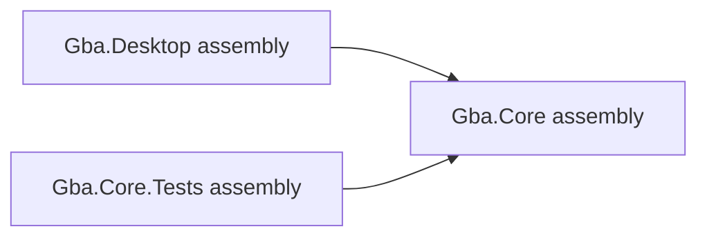

# Projects, assemblies and the .NET CLI


The `.sln` file groups projects for tools; it is not a compiled program. Each `.csproj` is an XML build recipe. A project usually produces an assembly (a `.dll`) containing compiled types and metadata. A namespace groups type names logically and can span files; it is not itself an assembly or folder.

```xml
<Project Sdk="Microsoft.NET.Sdk">
  <PropertyGroup>
    <TargetFramework>net8.0</TargetFramework>
    <Nullable>enable</Nullable>
    <ImplicitUsings>enable</ImplicitUsings>
  </PropertyGroup>
</Project>
```

`Sdk` imports standard build rules. `PropertyGroup` sets build values. `TargetFramework` selects the API/runtime target; it is different from the installed SDK version. `Nullable` enables nullability analysis. `ImplicitUsings` imports common namespaces automatically; explicit `using System;` is still legal. Source `.cs` files under the project are included automatically. Desktop also sets `OutputType` to `Exe` so it can run.

`ItemGroup` lists items such as `ProjectReference` and `PackageReference`. A project reference allows Desktop to use Core's public types and builds Core first. It must never point back from Core to Desktop. Internal types remain within their assembly unless you deliberately add friend-assembly access later; do not expose everything merely for tests.



Run from the repository root:

```text
dotnet restore GbaEmulator.sln
dotnet build GbaEmulator.sln
dotnet run --project src/Gba.Desktop
dotnet test GbaEmulator.sln
dotnet build GbaEmulator.sln -c Release
```

Restore downloads NuGet dependencies. Build compiles; run builds/runs an executable; test uses the test SDK and adapter to discover test methods. Debug emphasizes debugging; Release enables compiler optimizations suitable for performance measurements. Both should preserve intended semantics.

These commands explain how dependencies are added (the project references already exist; do not repeat them as setup):

```text
dotnet add src/Gba.Desktop/Gba.Desktop.csproj reference src/Gba.Core/Gba.Core.csproj
dotnet add path/to/project.csproj package Package.Name --version VERSION
```

The second line is syntax notation: substitute a real project, package and stable version when needed. A NuGet package supplies external assemblies/assets. Installing one is a design decision, not a prerequisite for every concept. Only the test project currently has packages: test SDK, xUnit and its discovery adapter. There is no renderer dependency yet.

The single top-level statement in `Program.cs` is shorthand for a compiler-generated entry point. You may replace it with an explicit `Program.Main` later. There are no source files required in an empty class library.

This scaffold targets .NET 8 to build with the SDK found on this machine. For a long-term project, move to .NET 10 LTS: install a stable SDK, change all three targets to `net10.0`, then restore/build/test. Do not enable preview language features. [.NET support policy](https://dotnet.microsoft.com/en-us/platform/support/policy) lists .NET 8 end of support in November 2026 and .NET 10 through November 2028; recheck it when upgrading.


## Where this meets the GBA

- [Getting started](../00-getting-started/README.md)
- [System overview](../01-system-overview/README.md)

## What you should understand now

- [ ] I can explain build, run, test and project references in my own words.
- [ ] I can predict the example before running it.

## C#/.NET refresher

Read [Microsoft: Projects, assemblies and the .NET CLI](https://learn.microsoft.com/en-us/dotnet/core/tools/); look specifically for **Build, run, test and project references**.
Use the [refresher index](README.md) to revisit prerequisites. These pages use stable features supported by this scaffold; newer examples in online documentation may require a later compiler.

## Your implementation task

Build the untouched solution, run the placeholder host, then inspect each project reference. Explain why removing the Desktop → Core reference would matter once Desktop uses a public Core type.

## Definition of done

- You can explain each property/item in the three small csproj files.
- You understand that an empty test run validates no hardware.

## Common mistakes

- Adding Vulkan to Core.
- Confusing namespaces with access permissions.
- Assuming the target framework installs an SDK.

## Further reading

[Official reference](https://learn.microsoft.com/en-us/dotnet/core/tools/) — Build, run, test and project references. Return to one of the hardware chapters above immediately after the exercise.

## Next chapter

[Choose the next concept needed by your milestone](README.md).
