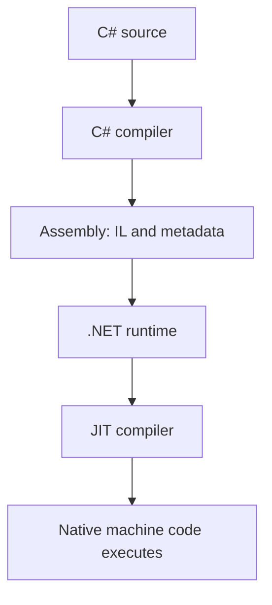

# How C# becomes machine code

IL is an intermediate instruction representation. The just-in-time (JIT) compiler translates methods into native code during execution; execution is not simply a C# source interpreter. Runtime optimizations and sensible data layouts can make an emulator fast, but performance still needs measurement.

The runtime also manages exceptions, type safety and garbage collection. Managed objects are tracked for reachability; native memory and GPU resources follow external ownership rules. A value type can live inside a managed heap object, so “value type = stack” is not a reliable model.

NativeAOT compiles ahead of time instead of relying on normal JIT compilation at runtime. It changes deployment and limits some dynamic behavior. It is an optional late experiment, not the starting architecture. Read [NativeAOT](https://learn.microsoft.com/en-us/dotnet/core/deploying/native-aot/) only after the normal build is correct and profiled.

## Where this meets the GBA

- [Timing](../14-timing-and-scheduling/README.md)
- [Vulkan output](../15-vulkan-output/README.md)

## What you should understand now

- [ ] I can explain il, jit compilation and runtime services in my own words.
- [ ] I can predict the example before running it.

## C#/.NET refresher

Read [Microsoft: How C# becomes machine code](https://learn.microsoft.com/en-us/dotnet/standard/managed-execution-process); look specifically for **IL, JIT compilation and runtime services**.
Use the [refresher index](README.md) to revisit prerequisites. These pages use stable features supported by this scaffold; newer examples in online documentation may require a later compiler.

## Your implementation task

Draw the path from a .cs file to executing instructions on your PC. Contrast host machine code with the GBA instructions represented as guest data.

## Definition of done

- You can explain why JIT compilation and emulated instruction execution are two different layers.

## Common mistakes

- Thinking ARM opcodes loaded from a ROM execute directly on the host.
- Designing for NativeAOT before measuring the normal runtime.

## Further reading

[Official reference](https://learn.microsoft.com/en-us/dotnet/standard/managed-execution-process) — IL, JIT compilation and runtime services. Return to one of the hardware chapters above immediately after the exercise.

## Next chapter

[Choose the next concept needed by your milestone](README.md).
