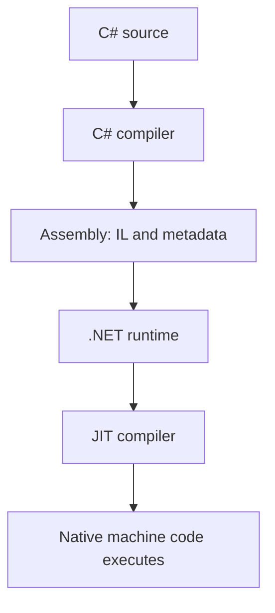

# How C# becomes machine code

## Before the technical details

The C# compiler translates your source into an assembly containing intermediate language and metadata. The .NET runtime executes managed code, commonly compiling methods into host machine code as needed. Your eventual emulator still has to interpret guest instructions itself; .NET does not know the GBA architecture for you.

## Syntax warm-up

### Open PowerShell and prepare this lesson

Open a PowerShell terminal (an IDE terminal is fine). Run this block once in each new terminal. The path below is your current checkout; if you move the repository, change that first path. All later commands on this page run from this folder, not from the lesson folder.

```powershell
Set-Location "C:\Users\victo\Desktop\RevoAdvance"
if (Test-Path ".work/dotnet10/dotnet.exe") {
    $env:PATH = "$PWD\.work\dotnet10;$env:PATH"
}
dotnet --version
```

Expect a version beginning with `10.`. The conditional uses the local SDK when present and changes PATH only for this terminal. If the command is missing or shows `8.`, complete the [.NET 10 setup](../00-getting-started/before-you-code.md#set-up-and-know-what-success-looks-like) before continuing.

Create the console scratchpad only if it does not already exist:

```powershell
if (-not (Test-Path ".work/SyntaxLab/SyntaxLab.csproj")) {
    dotnet new console --framework net10.0 --output .work/SyntaxLab
}
```

If it already exists, no output from that block is expected. Keep using that project; do not create another project for each example. [Command troubleshooting](../00-getting-started/running-and-testing.md) explains errors and the difference between running and testing.

Each example below is a complete, independent console program. Run one at a time in [SyntaxLab](../00-getting-started/before-you-code.md#a-separate-place-to-try-the-examples). These toy examples teach C#; the emulator implementation remains your exercise.

### A compiled method computes a value

**Run this example:** open `.work/SyntaxLab/Program.cs` in your editor, replace its entire contents with the C# block below, and save. Then run this in the PowerShell terminal prepared above:

```powershell
dotnet run --project .work/SyntaxLab/SyntaxLab.csproj
```

Compare the program output with “Expected output” below. After changing an example, save and run the same command again. Do not paste the command into the C# file. This command compiles your saved changes automatically.

```csharp
int result = Square(6);
Console.WriteLine(result);

int Square(int value)
{
    return value * value;
}
```

Expected output:

```text
36
```

Declaring the method tells the compiler its inputs and result type. Calling it computes a host C# result. You do not need to inspect generated machine code to understand this behavior. Runtime optimization should preserve that result.

### Try it before implementing

Run your sandbox normally, then with `-c Release`, and compare the numeric result. Explain the difference between C# compilation, executing a C# method, and interpreting a guest instruction number.

Continue with the detailed lesson below after you can explain your prediction.




IL is an intermediate instruction representation. The just-in-time (JIT) compiler translates methods into native code during execution; execution is not simply a C# source interpreter. Runtime optimizations and sensible data layouts can make an emulator fast, but performance still needs measurement.

The runtime also manages exceptions, type safety and garbage collection. Managed objects are tracked for reachability; native memory and GPU resources follow external ownership rules. A value type can live inside a managed heap object, so “value type = stack” is not a reliable model.

NativeAOT compiles ahead of time instead of relying on normal JIT compilation at runtime. It changes deployment and limits some dynamic behavior. It is an optional late experiment, not the starting architecture. Read [NativeAOT](https://learn.microsoft.com/en-us/dotnet/core/deploying/native-aot/) only after the normal build is correct and profiled.


## Where this meets the GBA

- [Timing](../14-timing-and-scheduling/README.md)
- [Vulkan output](../15-vulkan-output/README.md)

## What you should understand now

- [ ] I can explain il, jit compilation and runtime services in my own words.
- [ ] I can predict the example before running it.

## C#/.NET refresher

Read [Microsoft: How C# becomes machine code](https://learn.microsoft.com/en-us/dotnet/standard/managed-execution-process); look specifically for **IL, JIT compilation and runtime services**.
Use the [refresher index](README.md) to revisit prerequisites. These pages use stable features supported by this scaffold; newer examples in online documentation may require a later compiler.

## Your implementation task

Draw the path from a .cs file to executing instructions on your PC. Contrast host machine code with the GBA instructions represented as guest data.

## Run and check your practice

Write your toy practice in `.work/SyntaxLab/Program.cs`, save, and run from the repository-root terminal prepared above:

```powershell
dotnet run --project .work/SyntaxLab/SyntaxLab.csproj
```

Compare your result with a prediction written before running; your own exercise values may differ from the worked example. Save and rerun this same command after each edit. This runs a console program, not xUnit.

For an exercise that asks for assertions or parameterized tests, use the [TestLab setup and complete test-file examples](../csharp-and-dotnet/testing.md#a-complete-fact-example-test-project-only). Put your own public test class in `.work/TestLab/PracticeTests.cs`; save it, then run:

```powershell
dotnet test .work/TestLab/TestLab.csproj --list-tests
dotnet test .work/TestLab/TestLab.csproj --logger "console;verbosity=normal"
```

The list must contain your methods, and the run must report actual executed cases with zero failures. If only the supplied generic Fact/Theory examples are present, expect three cases; adding your own increases that count. If no cases are discovered, check the public class/method and `[Fact]`/`[Theory]` attributes. After each edit, save and rerun the second command. For a reading-only part of the task, answer its questions on paper; no new test is needed for that part.

## Definition of done

- You can explain why JIT compilation and emulated instruction execution are two different layers.

## Common mistakes

- Thinking ARM opcodes loaded from a ROM execute directly on the host.
- Designing for NativeAOT before measuring the normal runtime.

## Further reading

[Official reference](https://learn.microsoft.com/en-us/dotnet/standard/managed-execution-process) — IL, JIT compilation and runtime services. Return to one of the hardware chapters above immediately after the exercise.

## Next chapter

[Choose the next concept needed by your milestone](README.md).
